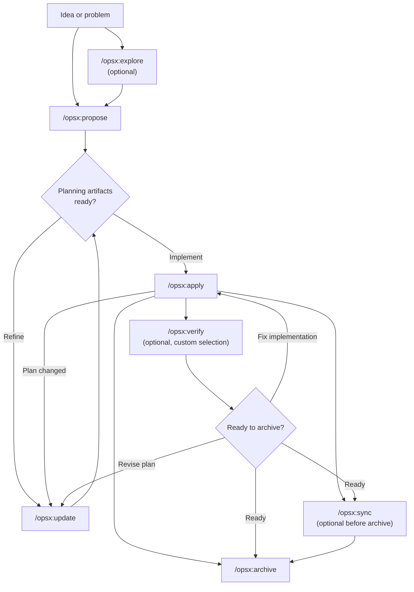
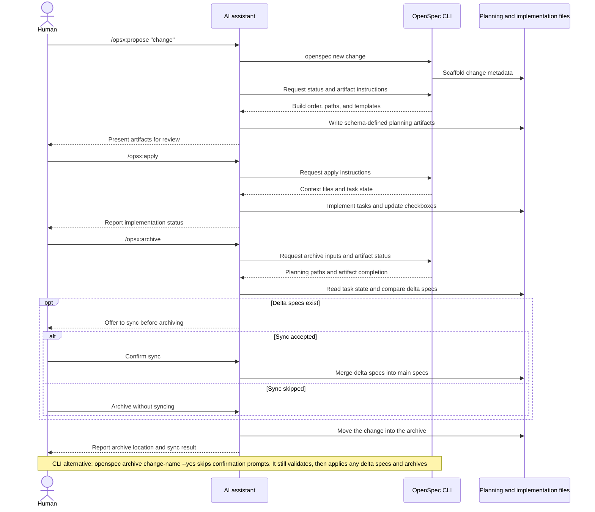

Dieser Leitfaden behandelt gängige OpenSpec-Workflow-Muster und erklärt, wann welches Muster sinnvoll ist. Informationen zur Grundeinrichtung finden Sie unter [Erste Schritte](/de-DE/getting-started/), eine Befehlsreferenz unter [Befehle](/de-DE/commands/).

## Philosophie: Aktionen statt Phasen

Traditionelle Workflows zwingen Sie durch festgelegte Phasen: erst Planung, dann Implementierung und schließlich Abschluss. In der Realität lässt sich die Arbeit jedoch nicht so ordentlich in Schubladen stecken.

OPSX verfolgt einen anderen Ansatz:

```text
Traditional (phase-locked):

  PLANNING ────────► IMPLEMENTING ────────► DONE
      │                    │
      │   "Can't go back"  │
      └────────────────────┘

OPSX (fluid actions):

  proposal ──► specs ──► design ──► tasks ──► implement
```

**Grundlegende Prinzipien:**

- **Aktionen statt Phasen** – Befehle sind Handlungsmöglichkeiten, keine Phasen, in denen Sie feststecken.
- **Abhängigkeiten ermöglichen Schritte** – Sie zeigen, was möglich ist, nicht, was als Nächstes zwingend erforderlich ist.

> **Anpassung:** OPSX-Workflows basieren auf Schemas, die die Abfolge von Artefakten festlegen. Wie Sie eigene Schemas erstellen, erfahren Sie unter [Anpassung](/de-DE/customization/).

## Workflow im Überblick

Der Standard-Workflow bleibt flexibel: Erkunden und Überprüfen sind optional, und
Sie können Planungsartefakte jederzeit aktualisieren, wenn die Implementierung neue Erkenntnisse liefert.



Der KI-Assistent steuert den Workflow, während die CLI zuverlässig
Gerüst, Status und Artefaktanweisungen bereitstellt:



## Zwei Modi

### Schneller Standardablauf (Profil `core`)

Bei neuen Installationen ist standardmäßig `core` aktiviert. Es bietet:
- `/opsx:explore`
- `/opsx:propose`
- `/opsx:apply`
- `/opsx:update`
- `/opsx:sync`
- `/opsx:archive`

Typischer Ablauf:

```text
/opsx:explore ──► /opsx:propose ──► /opsx:apply ──► /opsx:sync ──► /opsx:archive
  (optional)
```

#### Mit Erkunden beginnen – eine Gewohnheit, die sich lohnt

`/opsx:explore` gehört zum Standardprofil und ist kein erweitertes Zusatzfeature. Nutzen Sie den Befehl, wenn Sie ein Problem, aber noch keinen Plan haben – mit einem KI-Assistenten ist das meistens der Fall.

```text
You: /opsx:explore

AI:  What would you like to explore?

You: Our search results feel stale. I'm not sure if it's caching,
     indexing, or the query itself.

AI:  Let me look... [reads the search service and cache layer]
     It's the index: it only rebuilds nightly, so edits don't show
     up until the next day. Two options: rebuild on write (simple,
     more load) or a short-TTL cache invalidation (more moving parts,
     less load). Given your write volume is low, rebuild-on-write is
     the cleaner fix. Want to scope it?

You: Yes.

You: /opsx:propose rebuild-search-index-on-write
```

„Explore“ schreibt niemals Code und sonst nichts, sofern Sie nicht darum bitten oder sein Angebot annehmen. In diesem kostenlosen Gespräch ohne Verpflichtungen wird aus einer vagen Sorge eine präzise Änderung, sodass der anschließende Vorschlag klar umrissen ist. Wissen Sie bereits genau, was Sie möchten? Überspringen Sie den Schritt und wechseln Sie direkt zu `/opsx:propose`. Vollständige Anleitung: [Zuerst erkunden](/de-DE/explore/).

### Erweiterter/vollständiger Workflow (benutzerdefinierte Auswahl)

Wenn Sie ausdrückliche Befehle zum Einrichten und Umsetzen verwenden möchten (`/opsx:new`, `/opsx:continue`, `/opsx:ff`, `/opsx:verify`, `/opsx:bulk-archive`, `/opsx:onboard`), aktivieren Sie sie mit:

```bash
openspec config profile
openspec update
```

## Workflow-Muster (erweiterter Modus)

### Schnell eine Funktion umsetzen

Wenn Sie wissen, was Sie bauen möchten, und es nur noch um die Umsetzung geht:

```text
/opsx:new ──► /opsx:ff ──► /opsx:apply ──► /opsx:verify ──► /opsx:archive
```

**Beispielgespräch:**

```text
You: /opsx:new add-logout-button

AI:  Created openspec/changes/add-logout-button/
     Ready to create: proposal

You: /opsx:ff

AI:  Creating all planning artifacts...
     ✓ proposal.md
     ✓ specs/
     ✓ design.md
     ✓ tasks.md
     Ready for implementation!

You: /opsx:apply

AI:  Working through tasks...
     ✓ Added logout button to header
     ✓ Implemented session clearing
     ✓ Added confirmation dialog
     All tasks complete!

You: /opsx:archive

AI:  ✓ Merged specs
     ✓ Archived change
```

**Am besten geeignet für:** Kleine bis mittlere Funktionen, Fehlerbehebungen und unkomplizierte Änderungen.

### Erkunden

Wenn Anforderungen unklar sind oder Sie zunächst etwas untersuchen müssen:

```text
/opsx:explore ──► /opsx:new ──► /opsx:continue ──► ... ──► /opsx:apply
```

**Beispielgespräch:**

```text
You: /opsx:explore

AI:  What would you like to explore?

You: I want to improve page load performance but I'm not sure
     where the bottlenecks are.

AI:  Let me help investigate...
     [Analyzes bundle sizes, identifies slow queries, reviews
     component render patterns]

     I found three main bottlenecks:
     1. Large unoptimized images
     2. Synchronous data fetching in ProductList
     3. Re-renders from context changes

     Which would you like to address first?

You: Let's tackle the data fetching issue.

You: /opsx:new optimize-product-list-fetching

AI:  Created change. Ready to create: proposal

You: /opsx:continue

AI:  Creating proposal based on our exploration...
     [Writes proposal incorporating investigation insights]

     Ready to create: specs, design
     Which would you like next?

You: /opsx:continue

AI:  Creating specs...
```

**Am besten geeignet für:** Leistungsoptimierung, Fehlersuche, Architekturentscheidungen und unklare Anforderungen.

### Parallele Änderungen

Arbeiten Sie an mehreren Änderungen gleichzeitig:

```text
Change A: /opsx:new ──► /opsx:ff ──► /opsx:apply (in progress)
                                         │
                                    context switch
                                         │
Change B: /opsx:new ──► /opsx:ff ──────► /opsx:apply
```

**Beispielgespräch:**

```text
You: I'm working on add-dark-mode but got pulled into a bug fix

You: /opsx:new fix-login-redirect

AI:  Created openspec/changes/fix-login-redirect/

You: /opsx:ff

AI:  ✓ Created planning artifacts

You: /opsx:apply

AI:  Working on fix-login-redirect...
     [Implements the fix]
     All tasks complete!

You: /opsx:archive

AI:  ✓ Archived fix-login-redirect

You: Let's get back to dark mode

You: /opsx:apply add-dark-mode

AI:  Resuming add-dark-mode...
     Picking up at task 2.3: Update Header...
```

**Am besten geeignet für:** Parallele Arbeitsabläufe, dringende Unterbrechungen und Zusammenarbeit im Team.

Wenn mehrere Änderungen abgeschlossen sind, verwenden Sie `/opsx:bulk-archive`:

```text
You: /opsx:bulk-archive

AI:  Found 3 completed changes:
     - add-dark-mode (all tasks done)
     - fix-login-redirect (all tasks done)
     - update-footer (all tasks done)

     Checking for spec conflicts...
     ⚠ add-dark-mode and update-footer both touch specs/ui/

     Inspecting codebase to resolve...
     Both changes are implemented. Will apply in chronological order.

     Archive all 3 changes?

You: Yes

AI:  ✓ Archived add-dark-mode
     ✓ Archived fix-login-redirect
     ✓ Archived update-footer
     Specs merged in order: add-dark-mode → update-footer
```

Die Stapelarchivierung erkennt, wenn mehrere Änderungen dieselben Spezifikationen betreffen, und löst Konflikte, indem sie prüft, was tatsächlich implementiert wurde.

### Eine Änderung abschließen

Empfohlener Ablauf zum Abschließen:

```text
/opsx:apply ──► /opsx:verify ──► /opsx:archive
                    │                 │
              validates          prompts to sync
              implementation     if needed
```

#### Verify: Arbeit überprüfen

`/opsx:verify` prüft die Implementierung anhand Ihrer Artefakte in drei Dimensionen:

```text
You: /opsx:verify

AI:  Verifying add-auth...

     COMPLETENESS
     ✓ All 12 tasks in tasks.md are checked
     ✓ All requirements in specs have corresponding code
     ⚠ Scenario "Session timeout after inactivity" not tested

     CORRECTNESS
     ✓ Implementation matches spec intent
     ✓ Edge cases from scenarios are handled
     ✓ Error states match spec definitions

     COHERENCE
     ✓ Design decisions reflected in code structure
     ✓ Naming conventions consistent with design.md
     ⚠ Design mentions "event-driven" but implementation uses polling

     SUMMARY
     ─────────────────────────────
     Critical issues: 0
     Warnings: 2
     Ready to archive: Yes (with warnings)

     Recommendations:
     1. Add test for session timeout scenario
     2. Consider refactoring to event-driven as designed, or update design.md
```

**Was Verify prüft:**

| Dimension | Prüfumfang |
|-----------|------------------|
| Vollständigkeit | Alle Aufgaben erledigt, alle Anforderungen implementiert, alle Szenarien abgedeckt |
| Korrektheit | Implementierung entspricht der Absicht der Spezifikation, Randfälle berücksichtigt |
| Konsistenz | Entwurfsentscheidungen spiegeln sich im Code wider, Muster sind einheitlich |

Verify blockiert das Archivieren nicht, macht aber Probleme sichtbar, die Sie möglicherweise zuerst beheben möchten.

#### Archive: Änderung abschließen

`/opsx:archive` schließt die Änderung ab und verschiebt sie ins Archiv:

```text
You: /opsx:archive

AI:  Archiving add-auth...

     Artifact status:
     ✓ proposal.md exists
     ✓ specs/ exists
     ✓ design.md exists
     ✓ tasks.md exists (12/12 tasks complete)

     Delta specs: Not yet synced to main
     → Would you like to sync now?

You: Yes

AI:  ✓ Synced specs to openspec/specs/auth/spec.md
     ✓ Moved to openspec/changes/archive/2025-01-24-add-auth/

     Change archived successfully.
```

Wenn die Spezifikationen noch nicht synchronisiert sind, fragt „Archive“ nach. Unvollständige Aufgaben verhindern das Archivieren nicht, lösen aber eine Warnung aus.

## Wann Sie was verwenden sollten

### `/opsx:ff` im Vergleich zu `/opsx:continue`

| Situation | Verwenden |
|-----------|-----|
| Anforderungen klar, bereit zur Umsetzung | `/opsx:ff` |
| Noch am Erkunden, jeden Schritt prüfen wollen | `/opsx:continue` |
| Den Vorschlag vor den Spezifikationen iterieren wollen | `/opsx:continue` |
| Zeitdruck, schnell vorankommen müssen | `/opsx:ff` |
| Komplexe Änderung, Kontrolle behalten wollen | `/opsx:continue` |

**Faustregel:** Wenn Sie den gesamten Umfang von Anfang an beschreiben können, verwenden Sie `/opsx:ff`. Wenn Sie die Details erst im Verlauf klären, verwenden Sie `/opsx:continue`.

### Wann aktualisieren und wann neu beginnen?

Eine häufige Frage: Wann sollte eine bestehende Änderung aktualisiert und wann eine neue begonnen werden?

**Aktualisieren Sie die bestehende Änderung, wenn:**

- Die Absicht gleich bleibt, aber die Umsetzung verfeinert wird.
- Der Umfang verkleinert wird (zuerst das MVP, den Rest später).
- Erkenntnisse Korrekturen erfordern (die Codebasis sieht anders aus als erwartet).
- Der Entwurf aufgrund von Entdeckungen während der Implementierung angepasst wird.

**Beginnen Sie eine neue Änderung, wenn:**

- Sich die Absicht grundlegend geändert hat.
- Der Umfang zu einer völlig anderen Arbeit angewachsen ist.
- Die ursprüngliche Änderung unabhängig davon als „abgeschlossen“ gelten kann.
- Ergänzungen eher Verwirrung stiften als Klarheit schaffen würden.

```text
                     ┌─────────────────────────────────────┐
                     │     Is this the same work?          │
                     └──────────────┬──────────────────────┘
                                    │
                 ┌──────────────────┼──────────────────┐
                 │                  │                  │
                 ▼                  ▼                  ▼
          Same intent?      >50% overlap?      Can original
          Same problem?     Same scope?        be "done" without
                 │                  │          these changes?
                 │                  │                  │
       ┌────────┴────────┐  ┌──────┴──────┐   ┌───────┴───────┐
       │                 │  │             │   │               │
      YES               NO YES           NO  NO              YES
       │                 │  │             │   │               │
       ▼                 ▼  ▼             ▼   ▼               ▼
    UPDATE            NEW  UPDATE       NEW  UPDATE          NEW
```

**Beispiel: „Dunkelmodus hinzufügen“**

- „Benutzerdefinierte Themes sollen ebenfalls unterstützt werden“ → Neue Änderung (Umfang zu groß geworden).
- „Die Erkennung der Systemeinstellung ist schwieriger als erwartet“ → Änderung aktualisieren (gleiche Absicht).
- „Wir liefern erst den Schalter aus und fügen die Einstellungen später hinzu“ → Aktualisieren, archivieren, anschließend neue Änderung beginnen.

## Bewährte Vorgehensweisen

### Änderungen fokussiert halten

Jede Änderung sollte eine logische Arbeitseinheit umfassen. Wenn Sie „Funktion X hinzufügen und außerdem Y refaktorisieren“, erwägen Sie zwei getrennte Änderungen.

**Warum das wichtig ist:**
- Leichter zu überprüfen und zu verstehen.
- Übersichtlichere Archivhistorie.
- Unabhängig auslieferbar.
- Einfacher zurückzusetzen, falls nötig.

### Bei unklaren Anforderungen `/opsx:explore` verwenden

Erkunden Sie das Problemfeld, bevor Sie sich auf eine Änderung festlegen:

```text
You: /opsx:explore

AI:  What would you like to explore?

You: How should we handle rate limiting for our API?

AI:  Let me investigate your current setup and options...
     [Researches codebase, considers patterns]

     I see three approaches we could take:
     1. Middleware-based (simple, per-endpoint)
     2. Redis-backed (scalable, shared state)
     3. Token bucket per user (fair, complex)

     Your current stack suggests #1 or #2. What's your scale?
```

Die Erkundung klärt die Überlegungen, bevor Code geschrieben wird.

### Vor dem Archivieren überprüfen

Prüfen Sie mit `/opsx:verify`, ob die Implementierung den Artefakten entspricht:

```text
You: /opsx:verify

AI:  Verifying add-dark-mode...

     ✓ All tasks in tasks.md are checked
     ✓ Requirements in specs have corresponding code
     ✓ Design decisions are reflected in implementation

     Ready to archive!
```

So erkennen Sie Abweichungen, bevor Sie die Änderung abschließen.

### Änderungen eindeutig benennen

Gute Namen machen `openspec list` nützlich:

```text
Good:                          Avoid:
add-dark-mode                  feature-1
fix-login-redirect             update
optimize-product-query         changes
implement-2fa                  wip
```

## Schnellreferenz der Befehle

Die vollständige Beschreibung der Befehle und ihrer Optionen finden Sie unter [Befehle](/de-DE/commands/).

| Befehl | Zweck | Wann verwenden? |
|---------|---------|-------------|
| `/opsx:propose` | Änderung und Planungsartefakte erstellen | Schneller Standardablauf (Profil `core`) |
| `/opsx:explore` | Ideen gemeinsam mit der KI durchdenken | Bei Unsicherheit hier beginnen: unklare Anforderungen, Untersuchung, Vergleich von Optionen |
| `/opsx:new` | Grundgerüst einer Änderung anlegen | Erweiterter Modus, ausdrückliche Kontrolle über Artefakte |
| `/opsx:continue` | Nächstes Artefakt erstellen | Erweiterter Modus, schrittweise Erstellung von Artefakten |
| `/opsx:ff` | Alle Planungsartefakte erstellen | Erweiterter Modus, klarer Umfang |
| `/opsx:apply` | Aufgaben implementieren | Wenn Sie bereit sind, Code zu schreiben |
| `/opsx:verify` | Implementierung validieren | Erweiterter Modus, vor dem Archivieren |
| `/opsx:sync` | Delta-Spezifikationen zusammenführen | Erweiterter Modus, optional |
| `/opsx:archive` | Änderung abschließen | Wenn alle Arbeiten abgeschlossen sind |
| `/opsx:bulk-archive` | Mehrere Änderungen archivieren | Erweiterter Modus, parallele Arbeit |

## Nächste Schritte

- [Gute Spezifikationen schreiben](/de-DE/writing-specs/) – Woran Sie gute Anforderungen und Szenarien erkennen und wie Sie den Umfang einer Änderung passend bemessen.
- [Änderungen überprüfen](/de-DE/reviewing-changes/) – Der zweiminütige Prüfdurchlauf für einen Plan vor dem Schreiben von Code.
- [OpenSpec im Team](/de-DE/team-workflow/) – Wie Änderungen in Branches und Pull Requests passen.
- [Befehle](/de-DE/commands/) – Vollständige Befehlsreferenz mit Optionen.
- [Konzepte](/de-DE/concepts/) – Ausführliche Informationen zu Spezifikationen, Artefakten und Schemas.
- [Anpassung](/de-DE/customization/) – Benutzerdefinierte Workflows erstellen.
