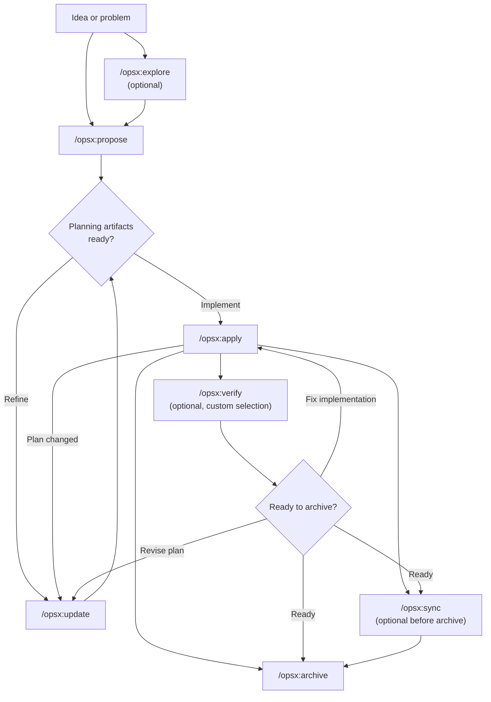
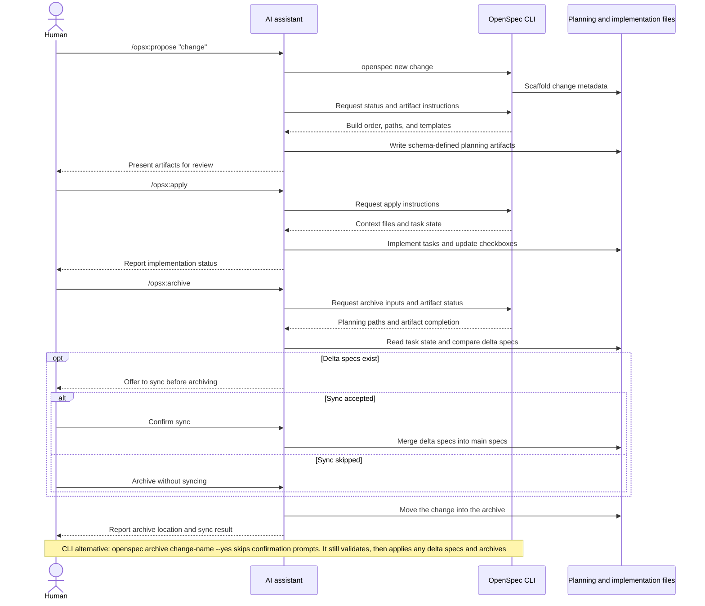

Esta guía describe patrones habituales de flujos de trabajo de OpenSpec y
cuándo conviene usar cada uno. Para la configuración básica, consulta
[Primeros pasos](/es-ES/getting-started/). Para consultar los comandos,
consulta [Comandos](/es-ES/commands/).

## Filosofía: acciones, no fases

Los flujos tradicionales te obligan a pasar por distintas fases: planificación,
implementación y finalización. Pero el trabajo real no encaja perfectamente en
esas categorías.

OPSX takes a different approach:

```text
Traditional (phase-locked):

  PLANNING ────────► IMPLEMENTING ────────► DONE
      │                    │
      │   "Can't go back"  │
      └────────────────────┘

OPSX (fluid actions):

  proposal ──► specs ──► design ──► tasks ──► implement
```

**Principios clave:**

- **Acciones, no fases**: los comandos son tareas que puedes realizar, no etapas que te encasillan.
- **Las dependencias habilitan el trabajo**: indican qué es posible, no qué debes hacer a continuación.

> **Personalización:** los flujos de trabajo de OPSX se basan en esquemas que
> definen la secuencia de artefactos. Consulta [Personalización](/es-ES/customization/)
> para saber cómo crear esquemas personalizados.

## Flujo de trabajo de un vistazo

El flujo predeterminado es flexible: la exploración y la verificación son
opcionales, y puedes actualizar los artefactos de planificación cuando la
implementación revele algo nuevo.



El asistente de IA dirige el flujo de trabajo, mientras que la CLI proporciona
una estructura inicial determinista, el estado y las instrucciones para los
artefactos:



## Dos modos

### Ruta rápida predeterminada (perfil `core`)

Las instalaciones nuevas usan el perfil predeterminado `core`, que ofrece:
- `/opsx:explore`
- `/opsx:propose`
- `/opsx:apply`
- `/opsx:update`
- `/opsx:sync`
- `/opsx:archive`

Flujo habitual:

```text
/opsx:explore ──► /opsx:propose ──► /opsx:apply ──► /opsx:sync ──► /opsx:archive
  (optional)
```

#### Empieza por explorar (un hábito que merece la pena adquirir)

`/opsx:explore` forma parte del perfil predeterminado, no es un complemento
avanzado. Conviene usarlo siempre que tengas un problema, pero aún no un plan;
con un asistente de IA, eso ocurre la mayoría de las veces.

```text
You: /opsx:explore

AI:  What would you like to explore?

You: Our search results feel stale. I'm not sure if it's caching,
     indexing, or the query itself.

AI:  Let me look... [reads the search service and cache layer]
     It's the index: it only rebuilds nightly, so edits don't show
     up until the next day. Two options: rebuild on write (simple,
     more load) or a short-TTL cache invalidation (more moving parts,
     less load). Given your write volume is low, rebuild-on-write is
     the cleaner fix. Want to scope it?

You: Yes.

You: /opsx:propose rebuild-search-index-on-write
```

Explore nunca escribe código y no crea nada más, a menos que se lo pidas o
aceptes su ofrecimiento. Es una conversación sin compromiso que convierte una
inquietud vaga en un cambio preciso, lo que ayuda a redactar una propuesta
concreta. ¿Ya sabes exactamente qué quieres? Omítelo y ve directamente a
`/opsx:propose`. Guía completa: [Empieza por explorar](/es-ES/explore/).

### Flujo ampliado/completo (selección personalizada)

Si quieres comandos explícitos para crear la estructura y desarrollarla
(`/opsx:new`, `/opsx:continue`, `/opsx:ff`, `/opsx:verify`,
`/opsx:bulk-archive`, `/opsx:onboard`), actívalos así:

```bash
openspec config profile
openspec update
```

## Patrones de flujo de trabajo (modo ampliado)

### Función sencilla

Si sabes qué quieres construir y solo necesitas implementarlo:

```text
/opsx:new ──► /opsx:ff ──► /opsx:apply ──► /opsx:verify ──► /opsx:archive
```

**Ejemplo de conversación:**

```text
You: /opsx:new add-logout-button

AI:  Created openspec/changes/add-logout-button/
     Ready to create: proposal

You: /opsx:ff

AI:  Creating all planning artifacts...
     ✓ proposal.md
     ✓ specs/
     ✓ design.md
     ✓ tasks.md
     Ready for implementation!

You: /opsx:apply

AI:  Working through tasks...
     ✓ Added logout button to header
     ✓ Implemented session clearing
     ✓ Added confirmation dialog
     All tasks complete!

You: /opsx:archive

AI:  ✓ Merged specs
     ✓ Archived change
```

**Ideal para:** funciones pequeñas o medianas, correcciones de errores y
cambios sencillos.

### Exploración

Si los requisitos no están claros o necesitas investigar antes:

```text
/opsx:explore ──► /opsx:new ──► /opsx:continue ──► ... ──► /opsx:apply
```

**Ejemplo de conversación:**

```text
You: /opsx:explore

AI:  What would you like to explore?

You: I want to improve page load performance but I'm not sure
     where the bottlenecks are.

AI:  Let me help investigate...
     [Analyzes bundle sizes, identifies slow queries, reviews
     component render patterns]

     I found three main bottlenecks:
     1. Large unoptimized images
     2. Synchronous data fetching in ProductList
     3. Re-renders from context changes

     Which would you like to address first?

You: Let's tackle the data fetching issue.

You: /opsx:new optimize-product-list-fetching

AI:  Created change. Ready to create: proposal

You: /opsx:continue

AI:  Creating proposal based on our exploration...
     [Writes proposal incorporating investigation insights]

     Ready to create: specs, design
     Which would you like next?

You: /opsx:continue

AI:  Creating specs...
```

**Ideal para:** optimizar el rendimiento, depurar, tomar decisiones de
arquitectura y aclarar requisitos.

### Cambios en paralelo

Trabaja en varios cambios a la vez:

```text
Change A: /opsx:new ──► /opsx:ff ──► /opsx:apply (in progress)
                                         │
                                    context switch
                                         │
Change B: /opsx:new ──► /opsx:ff ──────► /opsx:apply
```

**Ejemplo de conversación:**

```text
You: I'm working on add-dark-mode but got pulled into a bug fix

You: /opsx:new fix-login-redirect

AI:  Created openspec/changes/fix-login-redirect/

You: /opsx:ff

AI:  ✓ Created planning artifacts

You: /opsx:apply

AI:  Working on fix-login-redirect...
     [Implements the fix]
     All tasks complete!

You: /opsx:archive

AI:  ✓ Archived fix-login-redirect

You: Let's get back to dark mode

You: /opsx:apply add-dark-mode

AI:  Resuming add-dark-mode...
     Picking up at task 2.3: Update Header...
```

**Ideal para:** líneas de trabajo paralelas, interrupciones urgentes y
colaboración en equipo.

Si tienes varios cambios completados, usa `/opsx:bulk-archive`:

```text
You: /opsx:bulk-archive

AI:  Found 3 completed changes:
     - add-dark-mode (all tasks done)
     - fix-login-redirect (all tasks done)
     - update-footer (all tasks done)

     Checking for spec conflicts...
     ⚠ add-dark-mode and update-footer both touch specs/ui/

     Inspecting codebase to resolve...
     Both changes are implemented. Will apply in chronological order.

     Archive all 3 changes?

You: Yes

AI:  ✓ Archived add-dark-mode
     ✓ Archived fix-login-redirect
     ✓ Archived update-footer
     Specs merged in order: add-dark-mode → update-footer
```

El archivado en lote detecta si varios cambios afectan a las mismas
especificaciones y resuelve los conflictos comprobando qué se ha implementado
realmente.

### Completar un cambio

Flujo recomendado para completar un cambio:

```text
/opsx:apply ──► /opsx:verify ──► /opsx:archive
                    │                 │
              validates          prompts to sync
              implementation     if needed
```

#### Verify: comprueba tu trabajo

`/opsx:verify` valida la implementación comparándola con los artefactos en
tres dimensiones:

```text
You: /opsx:verify

AI:  Verifying add-auth...

     COMPLETENESS
     ✓ All 12 tasks in tasks.md are checked
     ✓ All requirements in specs have corresponding code
     ⚠ Scenario "Session timeout after inactivity" not tested

     CORRECTNESS
     ✓ Implementation matches spec intent
     ✓ Edge cases from scenarios are handled
     ✓ Error states match spec definitions

     COHERENCE
     ✓ Design decisions reflected in code structure
     ✓ Naming conventions consistent with design.md
     ⚠ Design mentions "event-driven" but implementation uses polling

     SUMMARY
     ─────────────────────────────
     Critical issues: 0
     Warnings: 2
     Ready to archive: Yes (with warnings)

     Recommendations:
     1. Add test for session timeout scenario
     2. Consider refactoring to event-driven as designed, or update design.md
```

**Qué comprueba verify:**

| Dimensión | Qué valida |
|-----------|------------------|
| Integridad | Se completaron todas las tareas, se implementaron todos los requisitos y se cubrieron los escenarios |
| Corrección | La implementación coincide con la intención de las especificaciones y gestiona los casos límite |
| Coherencia | Las decisiones de diseño se reflejan en el código y los patrones son coherentes |

Verify no impedirá el archivado, pero señalará los problemas que quizá quieras
resolver antes.

#### Archive: finalizar el cambio

`/opsx:archive` completa el cambio y lo traslada al archivo:

```text
You: /opsx:archive

AI:  Archiving add-auth...

     Artifact status:
     ✓ proposal.md exists
     ✓ specs/ exists
     ✓ design.md exists
     ✓ tasks.md exists (12/12 tasks complete)

     Delta specs: Not yet synced to main
     → Would you like to sync now?

You: Yes

AI:  ✓ Synced specs to openspec/specs/auth/spec.md
     ✓ Moved to openspec/changes/archive/2025-01-24-add-auth/

     Change archived successfully.
```

Si las especificaciones no están sincronizadas, archive te lo preguntará. No
impedirá archivar tareas incompletas, pero te avisará.

## Cuándo usar cada opción

### `/opsx:ff` frente a `/opsx:continue`

| Situación | Comando |
|-----------|-----|
| Requisitos claros y listo para implementar | `/opsx:ff` |
| Aún exploras y quieres revisar cada paso | `/opsx:continue` |
| Quieres iterar en la propuesta antes de redactar las especificaciones | `/opsx:continue` |
| Hay poco tiempo y necesitas avanzar rápido | `/opsx:ff` |
| Cambio complejo que quieres controlar | `/opsx:continue` |

**Regla general:** si puedes describir todo el alcance de antemano, usa
`/opsx:ff`. Si todavía lo estás definiendo, usa `/opsx:continue`.

### Cuándo actualizar y cuándo empezar de cero

Una pregunta frecuente: ¿cuándo conviene actualizar un cambio existente y
cuándo es mejor empezar uno nuevo?

**Actualiza el cambio existente cuando:**

- Se mantiene la intención, pero se perfecciona la ejecución.
- Se reduce el alcance (primero el producto mínimo viable y el resto después).
- Se hacen correcciones a partir de lo aprendido (la base de código no era como esperabas).
- Se ajusta el diseño a partir de lo descubierto durante la implementación.

**Empieza un cambio nuevo cuando:**

- La intención cambia de manera fundamental.
- El alcance se dispara y se convierte en un trabajo completamente distinto.
- El cambio original se puede marcar como «hecho» por separado.
- Los parches confundirían más de lo que aclararían.

```text
                     ┌─────────────────────────────────────┐
                     │     Is this the same work?          │
                     └──────────────┬──────────────────────┘
                                    │
                 ┌──────────────────┼──────────────────┐
                 │                  │                  │
                 ▼                  ▼                  ▼
          Same intent?      >50% overlap?      Can original
          Same problem?     Same scope?        be "done" without
                 │                  │          these changes?
                 │                  │                  │
       ┌────────┴────────┐  ┌──────┴──────┐   ┌───────┴───────┐
       │                 │  │             │   │               │
      YES               NO YES           NO  NO              YES
       │                 │  │             │   │               │
       ▼                 ▼  ▼             ▼   ▼               ▼
    UPDATE            NEW  UPDATE       NEW  UPDATE          NEW
```

**Ejemplo: «Añadir el modo oscuro»**

- «También hay que admitir temas personalizados» → Cambio nuevo (el alcance se disparó).
- «Detectar las preferencias del sistema es más difícil de lo esperado» → Actualización (la intención es la misma).
- «Publiquemos primero el interruptor y añadamos las preferencias después» → Actualiza y archiva; luego crea un cambio nuevo.

## Prácticas recomendadas

### Mantén los cambios bien delimitados

Incluye una unidad lógica de trabajo por cambio. Si vas a «añadir la función X
y también refactorizar Y», plantéate crear dos cambios separados.

**Por qué importa:**
- Son más fáciles de revisar y entender.
- El historial de archivado queda más claro.
- Se pueden publicar por separado.
- Si hace falta, es más sencillo revertirlos.

### Usa `/opsx:explore` si los requisitos no están claros

Antes de comprometerte con un cambio, explora el problema:

```text
You: /opsx:explore

AI:  What would you like to explore?

You: How should we handle rate limiting for our API?

AI:  Let me investigate your current setup and options...
     [Researches codebase, considers patterns]

     I see three approaches we could take:
     1. Middleware-based (simple, per-endpoint)
     2. Redis-backed (scalable, shared state)
     3. Token bucket per user (fair, complex)

     Your current stack suggests #1 or #2. What's your scale?
```

La exploración aclara las ideas antes de escribir código.

### Verifica antes de archivar

Usa `/opsx:verify` para comprobar que la implementación coincida con los artefactos:

```text
You: /opsx:verify

AI:  Verifying add-dark-mode...

     ✓ All tasks in tasks.md are checked
     ✓ Requirements in specs have corresponding code
     ✓ Design decisions are reflected in implementation

     Ready to archive!
```

Así detectarás las discrepancias antes de cerrar el cambio.

### Asigna nombres claros a los cambios

Los nombres claros hacen que `openspec list` resulte útil:

```text
Good:                          Avoid:
add-dark-mode                  feature-1
fix-login-redirect             update
optimize-product-query         changes
implement-2fa                  wip
```

## Referencia rápida de comandos

Para ver todos los detalles y las opciones de los comandos, consulta
[Comandos](/es-ES/commands/).

| Comando | Función | Cuándo usarlo |
|---------|---------|-------------|
| `/opsx:propose` | Crear el cambio y sus artefactos de planificación | Ruta rápida predeterminada (perfil `core`) |
| `/opsx:explore` | Analizar ideas con la IA | Empieza aquí si tienes dudas: requisitos poco claros, investigación o comparación de opciones |
| `/opsx:new` | Crear la estructura inicial de un cambio | Modo ampliado, control explícito de artefactos |
| `/opsx:continue` | Crear el siguiente artefacto | Modo ampliado, creación de artefactos paso a paso |
| `/opsx:ff` | Crear todos los artefactos de planificación | Modo ampliado, alcance claro |
| `/opsx:apply` | Implementar las tareas | Cuando estés listo para escribir código |
| `/opsx:verify` | Validar la implementación | Modo ampliado, antes de archivar |
| `/opsx:sync` | Combinar las especificaciones delta | Modo ampliado, opcional |
| `/opsx:archive` | Completar el cambio | Cuando hayas terminado todo el trabajo |
| `/opsx:bulk-archive` | Archivar varios cambios | Modo ampliado, trabajo en paralelo |

## Próximos pasos

- [Escribir buenas especificaciones](/es-ES/writing-specs/): cómo redactar requisitos y escenarios sólidos y delimitar correctamente un cambio
- [Revisar un cambio](/es-ES/reviewing-changes/): revisión de dos minutos del plan antes de escribir código
- [OpenSpec en equipo](/es-ES/team-workflow/): cómo organizar cambios, ramas y solicitudes de incorporación
- [Comandos](/es-ES/commands/): referencia completa de comandos y opciones
- [Conceptos](/es-ES/concepts/): detalles sobre especificaciones, artefactos y esquemas
- [Personalización](/es-ES/customization/): crear flujos de trabajo personalizados
