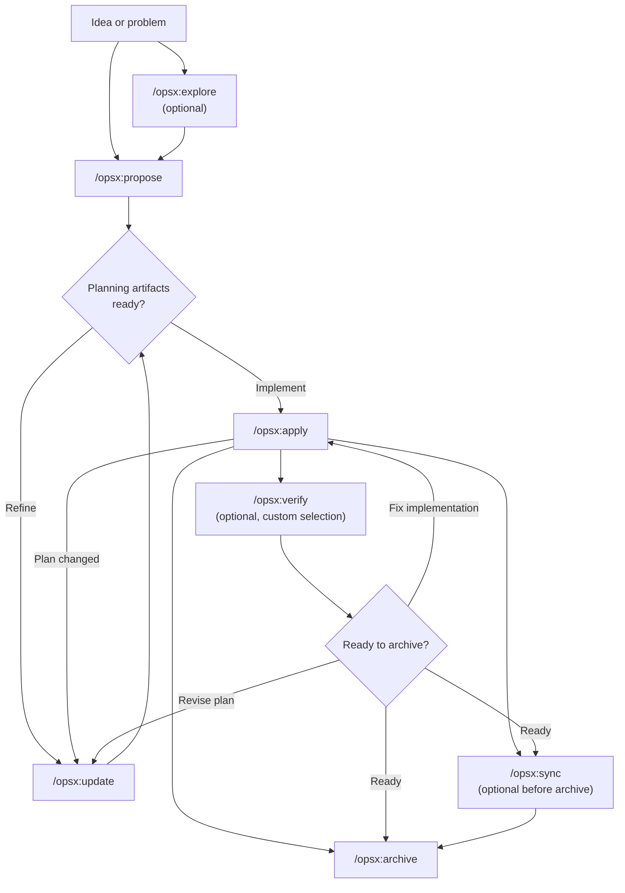
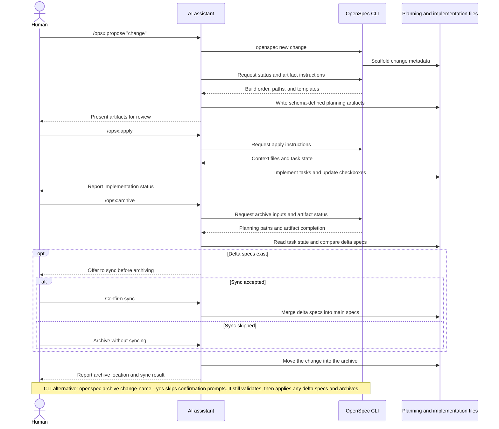

Ce guide présente les pratiques courantes d’OpenSpec et explique quand utiliser chacune d’elles. Pour la configuration de base, consultez [Bien démarrer](/fr-FR/getting-started/). Pour la référence des commandes, consultez [Commandes](/fr-FR/commands/).

## Philosophie : des actions, pas des phases

Les workflows traditionnels imposent des phases : planification, implémentation, puis achèvement. Or, le travail réel ne se range pas si facilement dans des cases.

OPSX adopte une approche différente :

```text
Traditional (phase-locked):

  PLANNING ────────► IMPLEMENTING ────────► DONE
      │                    │
      │   "Can't go back"  │
      └────────────────────┘

OPSX (fluid actions):

  proposal ──► specs ──► design ──► tasks ──► implement
```

**Principes clés :**

- **Des actions, pas des phases** — les commandes sont des opérations que vous pouvez effectuer, pas des étapes qui vous enferment
- **Les dépendances facilitent le travail** — elles indiquent ce qui est possible, pas ce qui est obligatoire ensuite

> **Personnalisation :** les workflows OPSX s’appuient sur des schémas qui définissent la séquence d’artefacts. Consultez [Personnalisation](/fr-FR/customization/) pour créer vos propres schémas.

## Workflow en bref

Le workflow par défaut reste fluide : exploration et vérification sont facultatives, et vous pouvez actualiser les artefacts de planification dès que l’implémentation révèle de nouveaux éléments.



L’assistant IA pilote le workflow ; la CLI fournit une structure reproductible, un état et des consignes pour les artefacts :



## Deux modes

### Parcours rapide par défaut (profil `core`)

Les nouvelles installations utilisent par défaut le profil `core`, qui comprend :
- `/opsx:explore`
- `/opsx:propose`
- `/opsx:apply`
- `/opsx:update`
- `/opsx:sync`
- `/opsx:archive`

Parcours habituel :

```text
/opsx:explore ──► /opsx:propose ──► /opsx:apply ──► /opsx:sync ──► /opsx:archive
  (optional)
```

#### Commencer par explorer (l’habitude à prendre)

`/opsx:explore` fait partie du profil par défaut, ce n’est pas une option avancée. Utilisez-la dès que vous avez un problème sans avoir encore de plan — ce qui est le cas la plupart du temps avec un assistant IA.

```text
You: /opsx:explore

AI:  What would you like to explore?

You: Our search results feel stale. I'm not sure if it's caching,
     indexing, or the query itself.

AI:  Let me look... [reads the search service and cache layer]
     It's the index: it only rebuilds nightly, so edits don't show
     up until the next day. Two options: rebuild on write (simple,
     more load) or a short-TTL cache invalidation (more moving parts,
     less load). Given your write volume is low, rebuild-on-write is
     the cleaner fix. Want to scope it?

You: Yes.

You: /opsx:propose rebuild-search-index-on-write
```

Explore n’écrit jamais de code, ni quoi que ce soit d’autre, sauf si vous le demandez ou acceptez sa proposition. Cette conversation sans engagement transforme une inquiétude vague en changement précis et donne ainsi une proposition mieux ciblée. Vous savez déjà exactement ce que vous voulez ? Passez directement à `/opsx:propose`. Guide complet : [Commencer par explorer](/fr-FR/explore/).

### Workflow étendu/complet (sélection personnalisée)

Pour utiliser les commandes explicites de création et de réalisation (`/opsx:new`, `/opsx:continue`, `/opsx:ff`, `/opsx:verify`, `/opsx:bulk-archive`, `/opsx:onboard`), activez-les avec :

```bash
openspec config profile
openspec update
```

## Modèles de workflow (mode étendu)

### Fonctionnalité rapide

Lorsque vous savez déjà quoi construire et qu’il ne reste qu’à réaliser le travail :

```text
/opsx:new ──► /opsx:ff ──► /opsx:apply ──► /opsx:verify ──► /opsx:archive
```

**Exemple de conversation :**

```text
You: /opsx:new add-logout-button

AI:  Created openspec/changes/add-logout-button/
     Ready to create: proposal

You: /opsx:ff

AI:  Creating all planning artifacts...
     ✓ proposal.md
     ✓ specs/
     ✓ design.md
     ✓ tasks.md
     Ready for implementation!

You: /opsx:apply

AI:  Working through tasks...
     ✓ Added logout button to header
     ✓ Implemented session clearing
     ✓ Added confirmation dialog
     All tasks complete!

You: /opsx:archive

AI:  ✓ Merged specs
     ✓ Archived change
```

**Idéal pour :** petites et moyennes fonctionnalités, corrections de bogues et changements simples.

### Exploration

Lorsque les exigences ne sont pas claires ou qu’une investigation est nécessaire :

```text
/opsx:explore ──► /opsx:new ──► /opsx:continue ──► ... ──► /opsx:apply
```

**Exemple de conversation :**

```text
You: /opsx:explore

AI:  What would you like to explore?

You: I want to improve page load performance but I'm not sure
     where the bottlenecks are.

AI:  Let me help investigate...
     [Analyzes bundle sizes, identifies slow queries, reviews
     component render patterns]

     I found three main bottlenecks:
     1. Large unoptimized images
     2. Synchronous data fetching in ProductList
     3. Re-renders from context changes

     Which would you like to address first?

You: Let's tackle the data fetching issue.

You: /opsx:new optimize-product-list-fetching

AI:  Created change. Ready to create: proposal

You: /opsx:continue

AI:  Creating proposal based on our exploration...
     [Writes proposal incorporating investigation insights]

     Ready to create: specs, design
     Which would you like next?

You: /opsx:continue

AI:  Creating specs...
```

**Idéal pour :** optimisation des performances, débogage, décisions d’architecture et exigences floues.

<a id="parallel-changes"></a>

### Changements en parallèle

Travailler sur plusieurs changements simultanément :

```text
Change A: /opsx:new ──► /opsx:ff ──► /opsx:apply (in progress)
                                         │
                                    context switch
                                         │
Change B: /opsx:new ──► /opsx:ff ──────► /opsx:apply
```

**Exemple de conversation :**

```text
You: I'm working on add-dark-mode but got pulled into a bug fix

You: /opsx:new fix-login-redirect

AI:  Created openspec/changes/fix-login-redirect/

You: /opsx:ff

AI:  ✓ Created planning artifacts

You: /opsx:apply

AI:  Working on fix-login-redirect...
     [Implements the fix]
     All tasks complete!

You: /opsx:archive

AI:  ✓ Archived fix-login-redirect

You: Let's get back to dark mode

You: /opsx:apply add-dark-mode

AI:  Resuming add-dark-mode...
     Picking up at task 2.3: Update Header...
```

**Idéal pour :** travaux en parallèle, interruptions urgentes et collaboration en équipe.

Lorsque plusieurs changements sont terminés, utilisez `/opsx:bulk-archive` :

```text
You: /opsx:bulk-archive

AI:  Found 3 completed changes:
     - add-dark-mode (all tasks done)
     - fix-login-redirect (all tasks done)
     - update-footer (all tasks done)

     Checking for spec conflicts...
     ⚠ add-dark-mode and update-footer both touch specs/ui/

     Inspecting codebase to resolve...
     Both changes are implemented. Will apply in chronological order.

     Archive all 3 changes?

You: Yes

AI:  ✓ Archived add-dark-mode
     ✓ Archived fix-login-redirect
     ✓ Archived update-footer
     Specs merged in order: add-dark-mode → update-footer
```

L’archivage groupé repère les changements qui touchent les mêmes spécifications et résout les conflits en vérifiant ce qui a réellement été implémenté.

### Terminer un changement

Parcours recommandé pour terminer un changement :

```text
/opsx:apply ──► /opsx:verify ──► /opsx:archive
                    │                 │
              validates          prompts to sync
              implementation     if needed
```

<a id="verify-check-your-work"></a>

#### Verify : vérifier le travail

`/opsx:verify` compare l’implémentation à vos artefacts selon trois dimensions :

```text
You: /opsx:verify

AI:  Verifying add-auth...

     COMPLETENESS
     ✓ All 12 tasks in tasks.md are checked
     ✓ All requirements in specs have corresponding code
     ⚠ Scenario "Session timeout after inactivity" not tested

     CORRECTNESS
     ✓ Implementation matches spec intent
     ✓ Edge cases from scenarios are handled
     ✓ Error states match spec definitions

     COHERENCE
     ✓ Design decisions reflected in code structure
     ✓ Naming conventions consistent with design.md
     ⚠ Design mentions "event-driven" but implementation uses polling

     SUMMARY
     ─────────────────────────────
     Critical issues: 0
     Warnings: 2
     Ready to archive: Yes (with warnings)

     Recommendations:
     1. Add test for session timeout scenario
     2. Consider refactoring to event-driven as designed, or update design.md
```

**Vérifications effectuées par verify :**

| Dimension | Vérifications |
|-----------|------------------|
| Exhaustivité | Toutes les tâches terminées, exigences implémentées et scénarios couverts |
| Exactitude | Respect de l’intention des spécifications et traitement des cas limites |
| Cohérence | Présence des décisions de conception dans le code et cohérence des pratiques |

Verify n’empêche pas l’archivage, mais signale les problèmes que vous souhaiterez peut-être corriger au préalable.

#### Archive : finaliser le changement

`/opsx:archive` termine le changement et le déplace dans les archives :

```text
You: /opsx:archive

AI:  Archiving add-auth...

     Artifact status:
     ✓ proposal.md exists
     ✓ specs/ exists
     ✓ design.md exists
     ✓ tasks.md exists (12/12 tasks complete)

     Delta specs: Not yet synced to main
     → Would you like to sync now?

You: Yes

AI:  ✓ Synced specs to openspec/specs/auth/spec.md
     ✓ Moved to openspec/changes/archive/2025-01-24-add-auth/

     Change archived successfully.
```

Si les spécifications ne sont pas synchronisées, Archive vous le proposera. La commande ne bloque pas l’archivage si des tâches sont incomplètes, mais affiche un avertissement.

## Quelle option choisir ?

<a id="opsxff-vs-opsxcontinue"></a>

### `/opsx:ff` ou `/opsx:continue`

| Situation | Commande |
|-----------|-----|
| Exigences claires, prêt à construire | `/opsx:ff` |
| Exploration en cours, revue de chaque étape souhaitée | `/opsx:continue` |
| Itérer sur la proposition avant les spécifications | `/opsx:continue` |
| Temps limité, besoin d’avancer vite | `/opsx:ff` |
| Changement complexe, besoin de garder le contrôle | `/opsx:continue` |

**Règle générale :** si vous pouvez définir tout le périmètre à l’avance, utilisez `/opsx:ff`. Si vous le précisez au fil du travail, utilisez `/opsx:continue`.

<a id="when-to-update-vs-start-fresh"></a>

### Mettre à jour ou repartir de zéro

Question fréquente : quand faut-il mettre à jour un changement existant ou en créer un nouveau ?

**Mettez à jour le changement existant si :**

- l’intention est la même, mais l’exécution est affinée
- le périmètre est réduit (MVP d’abord, reste plus tard)
- des découvertes imposent des corrections (la base de code ne correspond pas à vos attentes)
- la conception doit évoluer en fonction de découvertes faites pendant l’implémentation

**Créez un nouveau changement si :**

- l’intention a fondamentalement changé
- le périmètre s’est étendu à des travaux entièrement différents
- le changement initial peut être marqué « terminé » indépendamment
- les retouches rendraient le tout plus confus que clair

```text
                     ┌─────────────────────────────────────┐
                     │     Is this the same work?          │
                     └──────────────┬──────────────────────┘
                                    │
                 ┌──────────────────┼──────────────────┐
                 │                  │                  │
                 ▼                  ▼                  ▼
          Same intent?      >50% overlap?      Can original
          Same problem?     Same scope?        be "done" without
                 │                  │          these changes?
                 │                  │                  │
       ┌────────┴────────┐  ┌──────┴──────┐   ┌───────┴───────┐
       │                 │  │             │   │               │
      YES               NO YES           NO  NO              YES
       │                 │  │             │   │               │
       ▼                 ▼  ▼             ▼   ▼               ▼
    UPDATE            NEW  UPDATE       NEW  UPDATE          NEW
```

**Exemple : « Ajouter le mode sombre »**

- « Il faut aussi prendre en charge les thèmes personnalisés » → nouveau changement (périmètre élargi)
- « La détection des préférences système est plus complexe que prévu » → mise à jour (même intention)
- « Livrons d’abord le sélecteur, ajoutons les préférences plus tard » → mise à jour et archivage, puis nouveau changement

## Bonnes pratiques

### Garder les changements ciblés

Un changement par unité de travail logique. Si vous voulez « ajouter la fonctionnalité X et refactoriser Y », envisagez deux changements séparés.

**Pourquoi c’est important :**
- revue et compréhension plus faciles
- historique d’archivage plus clair
- livraison indépendante possible
- retour arrière plus simple au besoin

### Utiliser `/opsx:explore` lorsque les exigences sont floues

Avant de vous engager dans un changement, explorez le problème :

```text
You: /opsx:explore

AI:  What would you like to explore?

You: How should we handle rate limiting for our API?

AI:  Let me investigate your current setup and options...
     [Researches codebase, considers patterns]

     I see three approaches we could take:
     1. Middleware-based (simple, per-endpoint)
     2. Redis-backed (scalable, shared state)
     3. Token bucket per user (fair, complex)

     Your current stack suggests #1 or #2. What's your scale?
```

L’exploration clarifie les idées avant toute écriture de code.

### Vérifier avant d’archiver

Utilisez `/opsx:verify` pour vérifier que l’implémentation correspond aux artefacts :

```text
You: /opsx:verify

AI:  Verifying add-dark-mode...

     ✓ All tasks in tasks.md are checked
     ✓ Requirements in specs have corresponding code
     ✓ Design decisions are reflected in implementation

     Ready to archive!
```

Cette vérification repère les écarts avant la clôture du changement.

### Nommer clairement les changements

Des noms explicites rendent `openspec list` plus utile :

```text
Good:                          Avoid:
add-dark-mode                  feature-1
fix-login-redirect             update
optimize-product-query         changes
implement-2fa                  wip
```

## Référence rapide des commandes

Pour le détail complet des commandes et de leurs options, consultez [Commandes](/fr-FR/commands/).

| Commande | Rôle | Quand l’utiliser |
|---------|---------|-------------|
| `/opsx:propose` | Créer un changement et ses artefacts de planification | Parcours rapide par défaut (profil `core`) |
| `/opsx:explore` | Réfléchir à des idées avec l’IA | En cas d’incertitude : exigences floues, investigation ou comparaison d’options |
| `/opsx:new` | Créer la structure d’un changement | Mode étendu, contrôle explicite des artefacts |
| `/opsx:continue` | Créer l’artefact suivant | Mode étendu, création pas à pas |
| `/opsx:ff` | Créer tous les artefacts de planification | Mode étendu, périmètre clair |
| `/opsx:apply` | Réaliser les tâches | Prêt à écrire du code |
| `/opsx:verify` | Vérifier l’implémentation | Mode étendu, avant archivage |
| `/opsx:sync` | Fusionner les spécifications différentielles | Mode étendu, facultatif |
| `/opsx:archive` | Terminer le changement | Travail achevé |
| `/opsx:bulk-archive` | Archiver plusieurs changements | Mode étendu, travail en parallèle |

## Étapes suivantes

- [Rédiger de bonnes spécifications](/fr-FR/writing-specs/) — exigences et scénarios solides, et dimensionnement correct d’un changement
- [Revoir un changement](/fr-FR/reviewing-changes/) — examiner un plan pendant deux minutes avant d’écrire du code
- [OpenSpec en équipe](/fr-FR/team-workflow/) — intégrer les changements aux branches et aux pull requests
- [Commandes](/fr-FR/commands/) — référence complète et options
- [Concepts](/fr-FR/concepts/) — approfondir spécifications, artefacts et schémas
- [Personnalisation](/fr-FR/customization/) — créer des workflows personnalisés
