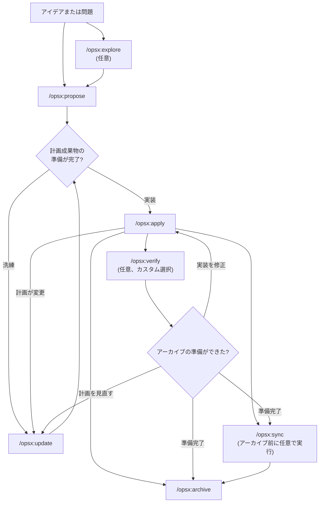
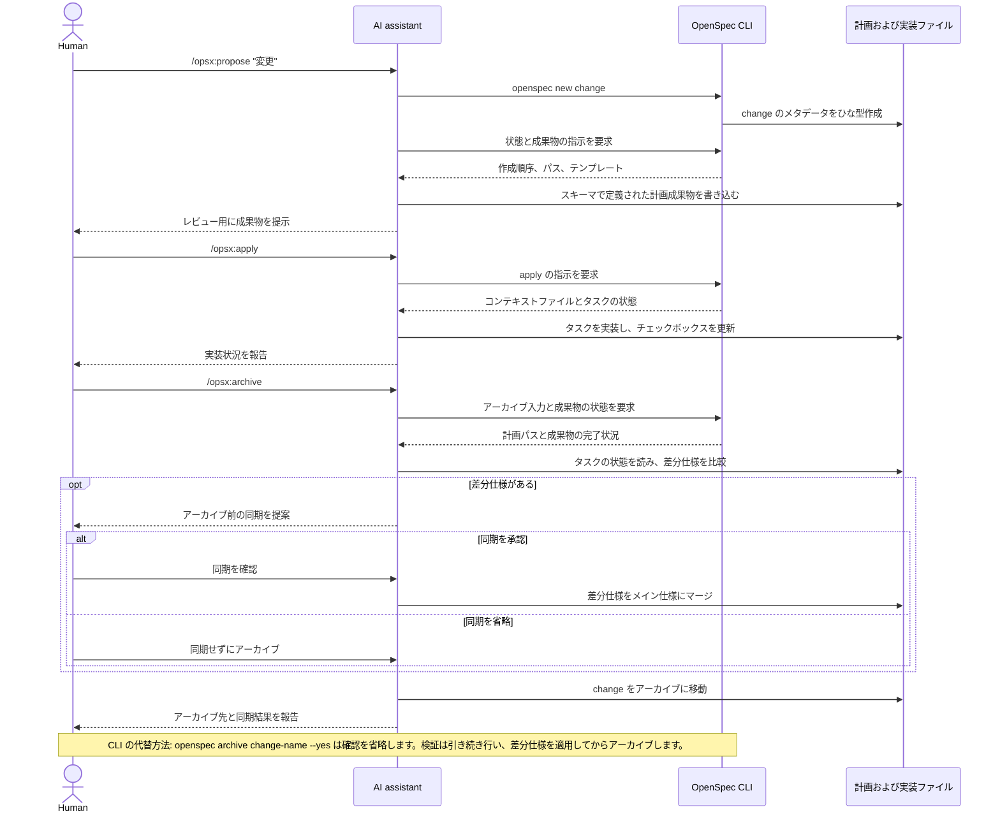

このガイドでは、OpenSpec の一般的なワークフローパターンと、それぞれを使うタイミングを説明します。基本的なセットアップは[はじめに](/ja-JP/getting-started/)、コマンドのリファレンスは[コマンド](/ja-JP/commands/)を参照してください。

## 基本理念: フェーズではなくアクション

従来のワークフローでは、計画、実装、完了というフェーズに従う必要があります。しかし実際の作業は、きれいに段階分けできるものではありません。

OPSX は異なる方法を採用しています。

```text
従来型（フェーズ固定）:

  計画 ────────────► 実装 ───────────────► 完了
      │                    │
      │   「前に戻れない」│
      └────────────────────┘

OPSX（柔軟なアクション）:

  proposal ──► specs ──► design ──► tasks ──► 実装
```

**主な原則:**

- **フェーズではなくアクション** — コマンドは実行できる操作であり、抜け出せない段階ではない
- **依存関係は可能性を広げるもの** — 次に必ず必要なものではなく、可能になることを示す

> **カスタマイズ:** OPSX ワークフローは成果物の順序を定義するスキーマによって動作します。カスタムスキーマの作成方法は[カスタマイズ](/ja-JP/customization/)を参照してください。

## ワークフローの概要

既定のワークフローは柔軟です。調査と検証は任意であり、実装中に新しいことが分かったら、いつでも計画成果物を更新できます。



AI アシスタントがワークフローを進め、CLI は一貫性のあるひな型、状態、成果物の指示を提供します。



## 2つのモード

### 既定の簡易フロー（`core` プロファイル）

新規インストールの既定値は `core` で、次のコマンドを利用できます。
- `/opsx:explore`
- `/opsx:propose`
- `/opsx:apply`
- `/opsx:update`
- `/opsx:sync`
- `/opsx:archive`

一般的な流れ:

```text
/opsx:explore ──► /opsx:propose ──► /opsx:apply ──► /opsx:sync ──► /opsx:archive
  (optional)
```

#### まず explore する（身に付ける価値のある習慣）

`/opsx:explore` は既定のプロファイルの一部であり、上級者向けの追加機能ではありません。AI アシスタントを使う場合、問題はあるが計画がない状況がほとんどなので、そうしたときに実行します。

```text
あなた: /opsx:explore

AI:  何を調べましょうか？

あなた: 検索結果が古いようです。キャッシュ、インデックス、
     クエリ自体のどれが原因か分かりません。

AI:  調べてみます... [検索サービスとキャッシュレイヤーを確認]
     原因はインデックスです。夜間にしか再構築されないため、編集内容は
     翌日まで反映されません。選択肢は2つです。書き込み時に再構築する
     （単純ですが負荷が増える）か、短い TTL のキャッシュ無効化を行う
     （仕組みは複雑になりますが、負荷は低下する）かです。書き込み量が
     少ないことを考えると、書き込み時の再構築がより簡潔な解決策です。
     範囲を整理しましょうか？

あなた: はい。

あなた: /opsx:propose rebuild-search-index-on-write
```

explore はコードを書かず、依頼するか提示に同意しない限り、他の内容も書き込みません。無料でリスクのない対話により漠然とした心配を明確な change にするため、その後の提案も的確になります。実現したいことがすでに明確なら、省略して `/opsx:propose` に進んでください。詳しくは[まず Explore](/ja-JP/explore/)を参照してください。

### 拡張/フルワークフロー（カスタム選択）

明示的なひな型作成/構築コマンド（`/opsx:new`、`/opsx:continue`、`/opsx:ff`、`/opsx:verify`、`/opsx:bulk-archive`、`/opsx:onboard`）を使うには、次を実行して有効にしてください。

```bash
openspec config profile
openspec update
```

## ワークフローパターン（拡張モード）

### 素早い機能開発

何を作るか決まっていて、あとは実行するだけの場合:

```text
/opsx:new ──► /opsx:ff ──► /opsx:apply ──► /opsx:verify ──► /opsx:archive
```

**会話例:**

```text
You: /opsx:new add-logout-button

AI:  Created openspec/changes/add-logout-button/
     Ready to create: proposal

You: /opsx:ff

AI:  Creating all planning artifacts...
     ✓ proposal.md
     ✓ specs/
     ✓ design.md
     ✓ tasks.md
     Ready for implementation!

You: /opsx:apply

AI:  Working through tasks...
     ✓ Added logout button to header
     ✓ Implemented session clearing
     ✓ Added confirmation dialog
     All tasks complete!

You: /opsx:archive

AI:  ✓ Merged specs
     ✓ Archived change
```

**最適な用途:** 小〜中規模の機能、バグ修正、単純な変更。

### 探索型

要件が不明確な場合や、先に調査が必要な場合:

```text
/opsx:explore ──► /opsx:new ──► /opsx:continue ──► ... ──► /opsx:apply
```

**会話例:**

```text
あなた: /opsx:explore

AI:  何を調べましょうか？

あなた: ページの読み込み性能を改善したいのですが、ボトルネックが
     どこにあるか分かりません。

AI:  調査します...
     [バンドルサイズを分析し、遅いクエリを特定し、
     コンポーネントのレンダリングパターンを確認]

     主なボトルネックが3つ見つかりました。
     1. 最適化されていない大きな画像
     2. ProductList での同期的なデータ取得
     3. context の変更による再レンダリング

     どれから対処しましょうか？

あなた: データ取得の問題から対処しましょう。

あなた: /opsx:new optimize-product-list-fetching

AI:  change を作成しました。作成可能: proposal

あなた: /opsx:continue

AI:  調査内容に基づいて提案を作成しています...
     [調査結果を盛り込んだ提案を作成]

     作成可能: specs、design
     次はどれを作成しますか？

あなた: /opsx:continue

AI:  specs を作成しています...
```

**最適な用途:** パフォーマンスの最適化、デバッグ、アーキテクチャ上の判断、不明確な要件。

### 並行する change

複数の change を同時に進めます。

```text
Change A: /opsx:new ──► /opsx:ff ──► /opsx:apply (in progress)
                                         │
                                    コンテキストを切り替え
                                         │
Change B: /opsx:new ──► /opsx:ff ──────► /opsx:apply
```

**会話例:**

```text
あなた: add-dark-mode を作業中ですが、バグ修正に取りかかる必要ができました。

あなた: /opsx:new fix-login-redirect

AI:  openspec/changes/fix-login-redirect/ を作成しました。

あなた: /opsx:ff

AI:  ✓ 計画成果物を作成しました

あなた: /opsx:apply

AI:  fix-login-redirect を作業しています...
     [修正を実装]
     すべてのタスクが完了しました。

あなた: /opsx:archive

AI:  ✓ fix-login-redirect をアーカイブしました

あなた: ダークモードの作業に戻りましょう。

あなた: /opsx:apply add-dark-mode

AI:  add-dark-mode を再開します...
     タスク 2.3: Header を更新、から続けます...
```

**最適な用途:** 並行作業、緊急の割り込み、チームでの協業。

完了した change が複数ある場合は `/opsx:bulk-archive` を使います。

```text
あなた: /opsx:bulk-archive

AI:  完了した change が3件見つかりました。
     - add-dark-mode (すべてのタスク完了)
     - fix-login-redirect (すべてのタスク完了)
     - update-footer (すべてのタスク完了)

     仕様の競合を確認しています...
     ⚠ add-dark-mode と update-footer の両方が specs/ui/ に変更を加えています

     解決のためコードベースを確認しています...
     どちらの変更も実装済みです。時系列順に適用します。

     3件すべての change をアーカイブしますか？

あなた: はい

AI:  ✓ add-dark-mode をアーカイブしました
     ✓ fix-login-redirect をアーカイブしました
     ✓ update-footer をアーカイブしました
     add-dark-mode → update-footer の順に仕様をマージしました
```

一括アーカイブでは、複数の change が同じ仕様に触れることを検出し、実際の実装を確認して競合を解決します。

### change を完了する

推奨する完了フロー:

```text
/opsx:apply ──► /opsx:verify ──► /opsx:archive
                    │                 │
              実装を検証           必要に応じて
                                 同期を確認
```

#### Verify: 作業を確認する

`/opsx:verify` は、成果物と照らし合わせて実装を次の3つの観点で検証します。

```text
あなた: /opsx:verify

AI:  add-auth を検証しています...

     完全性
     ✓ tasks.md の12個のタスクすべてにチェック済み
     ✓ specs のすべての要件に対応するコードがある
     ⚠ シナリオ「操作なしのセッションタイムアウト」がテストされていない

     正確性
     ✓ 実装が仕様の意図に一致
     ✓ シナリオの境界ケースに対応
     ✓ エラー状態が仕様の定義に一致

     一貫性
     ✓ 設計上の判断がコード構成に反映
     ✓ design.md と命名規約が一致
     ⚠ 設計では「イベント駆動」としていますが、実装ではポーリングを使用

     サマリー
     ─────────────────────────────
     重大な問題: 0
     警告: 2
     アーカイブ可能: はい（警告あり）

     推奨事項:
     1. セッションタイムアウトのシナリオのテストを追加する
     2. 設計どおりイベント駆動にリファクタリングするか、design.md を更新する
```

**verify で確認する内容:**

| 観点 | 検証内容 |
|-----------|------------------|
| 完全性 | すべてのタスクが完了し、すべての要件が実装され、シナリオが網羅されている |
| 正確性 | 実装が仕様の意図に一致し、境界ケースに対応している |
| 一貫性 | 設計上の判断がコードに反映され、パターンに一貫性がある |

verify はアーカイブを妨げませんが、先に対処した方がよい問題を提示します。

#### Archive: change を確定する

`/opsx:archive` は change を完了し、アーカイブに移動します。

```text
あなた: /opsx:archive

AI:  add-auth をアーカイブしています...

     成果物の状態:
     ✓ proposal.md が存在
     ✓ specs/ が存在
     ✓ design.md が存在
     ✓ tasks.md が存在（12/12件のタスク完了）

     差分仕様: メイン仕様に未同期
     → 今すぐ同期しますか？

あなた: はい

AI:  ✓ 仕様を openspec/specs/auth/spec.md に同期しました
     ✓ openspec/changes/archive/2025-01-24-add-auth/ に移動しました

     change をアーカイブしました。
```

仕様が未同期の場合、Archive は確認を求めます。未完了のタスクがあってもブロックしませんが、警告を表示します。

## どの方法を使うか

### `/opsx:ff` vs `/opsx:continue`

| 状況 | 使用するもの |
|-----------|-----|
| 要件が明確で、実装を始める準備ができている | `/opsx:ff` |
| 調査中で、各手順をレビューしたい | `/opsx:continue` |
| 仕様作成前に提案を反復したい | `/opsx:continue` |
| 時間に余裕がなく、素早く進めたい | `/opsx:ff` |
| 複雑な change で、細かく制御したい | `/opsx:continue` |

**目安:** 最初に全範囲を説明できるなら `/opsx:ff` を使います。作業しながら内容を明らかにするなら `/opsx:continue` を使います。

### 更新するか、新しく始めるか

よくある疑問は、既存の change を更新してよいのはどんな場合で、新しいものを始めるべきなのはいつか、ということです。

**既存の change を更新する場合:**

- 目的は同じで、実行方法を洗練する
- 範囲を縮小する（まず MVP を実装し、残りは後で対応）
- 新たな理解に基づいて修正する（コードベースが想定と異なる）
- 実装中の発見に基づいて設計を調整する

**新しい change を始める場合:**

- 目的が根本的に変わった
- 範囲が別の作業にまで大きく広がった
- 元の change を単独で「完了」にできる
- 継ぎ足しの修正が明確さより混乱をもたらす

```text
                     ┌─────────────────────────────────────┐
                     │     これは同じ作業か？               │
                     └──────────────┬──────────────────────┘
                                    │
                 ┌──────────────────┼──────────────────┐
                 │                  │                  │
                 ▼                  ▼                  ▼
          目的は同じ？       50%超が重複？      元の作業は
          問題は同じ？       範囲は同じ？       これらの変更なしで
                 │                  │          完了できる？
                 │                  │                  │
       ┌────────┴────────┐  ┌──────┴──────┐   ┌───────┴───────┐
       │                 │  │             │   │               │
      YES               NO YES           NO  NO              YES
       │                 │  │             │   │               │
       ▼                 ▼  ▼             ▼   ▼               ▼
    更新              新規   更新         新規   更新           新規
```

**例: 「ダークモードを追加する」**

- 「カスタムテーマにも対応する必要がある」→ 新しい change（範囲が大きく拡大）
- 「システム設定の検出は想定より難しい」→ 更新（目的は同じ）
- 「まず切り替えをリリースし、設定対応は後で追加する」→ 更新してアーカイブし、その後新しい change を作成

## ベストプラクティス

### change の範囲を絞る

1つの change には、論理的な作業単位を1つだけ含めます。「機能 X を追加し、さらに Y をリファクタリングする」場合は、別々の change にすることを検討してください。

**重要な理由:**
- レビューと理解が容易になる
- アーカイブ履歴が明確になる
- 独立してリリースできる
- 必要な場合のロールバックが簡単になる

### 要件が不明確な場合は `/opsx:explore` を使う

change に着手する前に、問題領域を調査します。

```text
あなた: /opsx:explore

AI:  何を調べましょうか？

あなた: API のレート制限はどのように実装すればよいですか？

AI:  現在の構成と選択肢を調べます...
     [コードベースを調べ、パターンを検討]

     方法は3つあります。
     1. ミドルウェア方式（単純で、エンドポイントごとに設定）
     2. Redis を利用（スケーラブルで、状態を共有）
     3. ユーザーごとのトークンバケット（公平だが複雑）

     現在の技術スタックでは1か2が適しています。規模はどの程度ですか？
```

explore によってコードを書く前に考えを明確にできます。

### アーカイブ前に検証する

`/opsx:verify` を使って、実装が成果物に一致するか確認します。

```text
あなた: /opsx:verify

AI:  add-dark-mode を検証しています...

     ✓ tasks.md のすべてのタスクにチェック済み
     ✓ specs の要件に対応するコードがある
     ✓ 設計上の判断が実装に反映されている

     アーカイブの準備ができました。
```

change を完了する前に不一致を見つけます。

### change に分かりやすい名前を付ける

適切な名前を付けると `openspec list` が役立ちます。

```text
推奨:                           避ける:
add-dark-mode                  feature-1
fix-login-redirect             update
optimize-product-query         changes
implement-2fa                  wip
```

## コマンド早見表

コマンドとオプションの詳細は[コマンド](/ja-JP/commands/)を参照してください。

| コマンド | 目的 | 使用するタイミング |
|---------|---------|-------------|
| `/opsx:propose` | change と計画成果物を作成 | 既定の簡易フロー（`core` プロファイル） |
| `/opsx:explore` | AI とアイデアを検討 | 迷っているとき。不明確な要件、調査、選択肢の比較 |
| `/opsx:new` | change のひな型を作成 | 拡張モードで成果物を明示的に制御 |
| `/opsx:continue` | 次の成果物を作成 | 拡張モードで成果物を段階的に作成 |
| `/opsx:ff` | すべての計画成果物を作成 | 拡張モードで範囲が明確なとき |
| `/opsx:apply` | タスクを実装 | コードを書く準備ができたとき |
| `/opsx:verify` | 実装を検証 | 拡張モードで、アーカイブの前 |
| `/opsx:sync` | 差分仕様をマージ | 拡張モードで、必要に応じて |
| `/opsx:archive` | change を完了 | すべての作業が完了したとき |
| `/opsx:bulk-archive` | 複数の change をアーカイブ | 拡張モードで並行作業を行うとき |

## 次の手順

- [良い仕様を書く](/ja-JP/writing-specs/) — 強い要件やシナリオの特徴と、change の適切な規模
- [変更のレビュー](/ja-JP/reviewing-changes/) — コードを書く前に、下書きされた計画を2分で確認
- [チームで OpenSpec を使う](/ja-JP/team-workflow/) — change とブランチ、プルリクエストの連携
- [コマンド](/ja-JP/commands/) — オプションを含むコマンドリファレンス
- [概念](/ja-JP/concepts/) — 仕様、成果物、スキーマの詳しい説明
- [カスタマイズ](/ja-JP/customization/) — カスタムワークフローを作成
