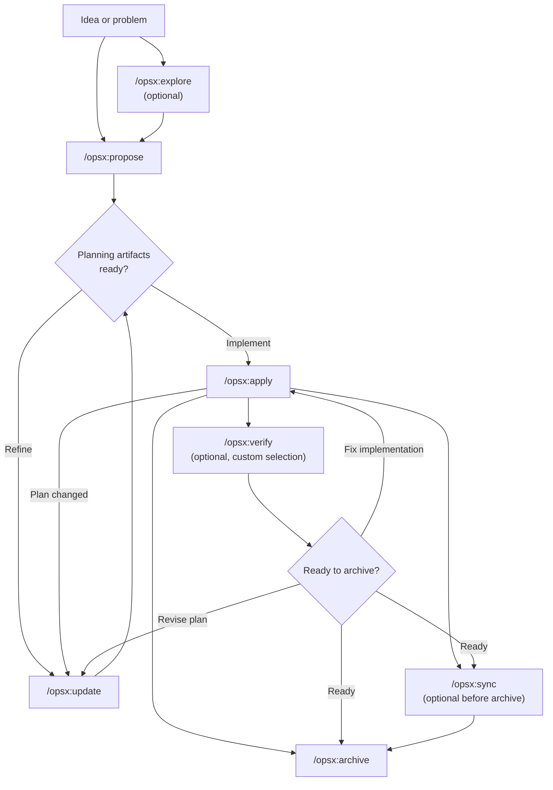
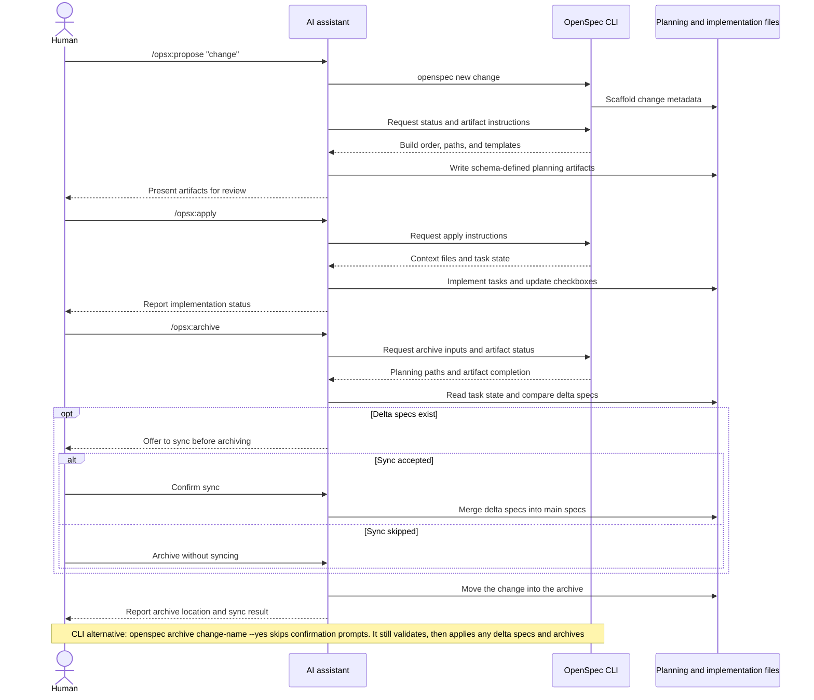

이 안내서에서는 OpenSpec의 일반적인 워크플로 패턴과 각 패턴의 사용 시점을 설명합니다. 기본 설정은 [시작하기](/ko-KR/getting-started/)를, 명령 참조는 [명령](/ko-KR/commands/)을 확인하세요.

## 철학: 단계가 아니라 동작

기존 워크플로는 계획, 구현, 완료의 단계를 순서대로 거치도록 강제합니다. 하지만 실제 작업은 그렇게 깔끔하게 단계별로 나뉘지 않습니다.

OPSX는 다른 접근 방식을 사용합니다.

```text
Traditional (phase-locked):

  PLANNING ────────► IMPLEMENTING ────────► DONE
      │                    │
      │   "Can't go back"  │
      └────────────────────┘

OPSX (fluid actions):

  proposal ──► specs ──► design ──► tasks ──► implement
```

**핵심 원칙:**

- **단계가 아니라 동작** — 명령은 수행할 수 있는 작업이지 갇히게 되는 단계가 아닙니다.
- **의존성은 촉진 요소** — 다음에 가능한 작업을 보여 줄 뿐 다음에 해야 할 작업을 강제하지 않습니다.

> **사용자 지정:** OPSX 워크플로는 산출물 순서를 정의하는 스키마에 따라 진행됩니다. 사용자 지정 스키마를 만드는 방법은 [사용자 지정](/ko-KR/customization/)을 참조하세요.

## 워크플로 한눈에 보기

기본 워크플로는 유연합니다. 탐색과 검증은 선택 사항이며 구현 과정에서 새로운 사실을 알게 되면 언제든 계획 산출물을 업데이트할 수 있습니다.



AI 어시스턴트가 워크플로를 진행하고 CLI는 결정적인 기본 구조, 상태, 산출물 지침을 제공합니다.



## 두 가지 모드

### 기본 빠른 경로(`core` 프로필)

새로 설치하면 기본적으로 다음 항목이 포함된 `core`를 사용합니다.
- `/opsx:explore`
- `/opsx:propose`
- `/opsx:apply`
- `/opsx:update`
- `/opsx:sync`
- `/opsx:archive`

일반적인 흐름:

```text
/opsx:explore ──► /opsx:propose ──► /opsx:apply ──► /opsx:sync ──► /opsx:archive
  (optional)
```

#### 탐색부터 시작하기(꼭 익힐 만한 습관)

`/opsx:explore`는 고급 추가 기능이 아니라 기본 프로필의 일부입니다. AI 어시스턴트와 작업할 때 대부분 문제가 있지만 계획은 아직 없는 경우에 사용하세요.

```text
You: /opsx:explore

AI:  What would you like to explore?

You: Our search results feel stale. I'm not sure if it's caching,
     indexing, or the query itself.

AI:  Let me look... [reads the search service and cache layer]
     It's the index: it only rebuilds nightly, so edits don't show
     up until the next day. Two options: rebuild on write (simple,
     more load) or a short-TTL cache invalidation (more moving parts,
     less load). Given your write volume is low, rebuild-on-write is
     the cleaner fix. Want to scope it?

You: Yes.

You: /opsx:propose rebuild-search-index-on-write
```

탐색은 코드를 작성하지 않으며 사용자에게 요청을 받거나 제안을 수락하지 않는 한 다른 내용도 쓰지 않습니다. 막연한 걱정을 명확한 변경 사항으로 바꾸는 부담 없는 대화이므로 뒤이어 작성하는 제안도 구체적입니다. 원하는 바를 정확히 알고 있나요? 탐색을 건너뛰고 바로 `/opsx:propose`를 실행하세요. 자세한 안내는 [먼저 탐색하기](/ko-KR/explore/)를 참조하세요.

### 확장/전체 워크플로(사용자 지정 선택)

명시적인 기본 구조 작성 및 빌드 명령(`/opsx:new`, `/opsx:continue`, `/opsx:ff`, `/opsx:verify`, `/opsx:bulk-archive`, `/opsx:onboard)을 사용하려면 다음을 실행하세요.

```bash
openspec config profile
openspec update
```

## 워크플로 패턴(확장 모드)

### 빠른 기능 구현

무엇을 만들지 알고 있으며 실행만 하면 되는 경우:

```text
/opsx:new ──► /opsx:ff ──► /opsx:apply ──► /opsx:verify ──► /opsx:archive
```

**대화 예:**

```text
You: /opsx:new add-logout-button

AI:  Created openspec/changes/add-logout-button/
     Ready to create: proposal

You: /opsx:ff

AI:  Creating all planning artifacts...
     ✓ proposal.md
     ✓ specs/
     ✓ design.md
     ✓ tasks.md
     Ready for implementation!

You: /opsx:apply

AI:  Working through tasks...
     ✓ Added logout button to header
     ✓ Implemented session clearing
     ✓ Added confirmation dialog
     All tasks complete!

You: /opsx:archive

AI:  ✓ Merged specs
     ✓ Archived change
```

**적합한 작업:** 소규모 및 중간 규모 기능, 버그 수정, 단순한 변경 사항

### 탐색 중심

요구 사항이 불분명하거나 먼저 조사해야 할 때:

```text
/opsx:explore ──► /opsx:new ──► /opsx:continue ──► ... ──► /opsx:apply
```

**대화 예:**

```text
You: /opsx:explore

AI:  What would you like to explore?

You: I want to improve page load performance but I'm not sure
     where the bottlenecks are.

AI:  Let me help investigate...
     [Analyzes bundle sizes, identifies slow queries, reviews
     component render patterns]

     I found three main bottlenecks:
     1. Large unoptimized images
     2. Synchronous data fetching in ProductList
     3. Re-renders from context changes

     Which would you like to address first?

You: Let's tackle the data fetching issue.

You: /opsx:new optimize-product-list-fetching

AI:  Created change. Ready to create: proposal

You: /opsx:continue

AI:  Creating proposal based on our exploration...
     [Writes proposal incorporating investigation insights]

     Ready to create: specs, design
     Which would you like next?

You: /opsx:continue

AI:  Creating specs...
```

**적합한 작업:** 성능 최적화, 디버깅, 아키텍처 결정, 불명확한 요구 사항

### 변경 사항 병렬 처리

여러 변경 사항을 동시에 진행합니다.

```text
Change A: /opsx:new ──► /opsx:ff ──► /opsx:apply (in progress)
                                         │
                                    context switch
                                         │
Change B: /opsx:new ──► /opsx:ff ──────► /opsx:apply
```

**대화 예:**

```text
You: I'm working on add-dark-mode but got pulled into a bug fix

You: /opsx:new fix-login-redirect

AI:  Created openspec/changes/fix-login-redirect/

You: /opsx:ff

AI:  ✓ Created planning artifacts

You: /opsx:apply

AI:  Working on fix-login-redirect...
     [Implements the fix]
     All tasks complete!

You: /opsx:archive

AI:  ✓ Archived fix-login-redirect

You: Let's get back to dark mode

You: /opsx:apply add-dark-mode

AI:  Resuming add-dark-mode...
     Picking up at task 2.3: Update Header...
```

**적합한 작업:** 병렬 작업 흐름, 긴급한 작업의 우선 처리, 팀 협업

완료된 변경 사항이 여러 개라면 `/opsx:bulk-archive`를 사용하세요.

```text
You: /opsx:bulk-archive

AI:  Found 3 completed changes:
     - add-dark-mode (all tasks done)
     - fix-login-redirect (all tasks done)
     - update-footer (all tasks done)

     Checking for spec conflicts...
     ⚠ add-dark-mode and update-footer both touch specs/ui/

     Inspecting codebase to resolve...
     Both changes are implemented. Will apply in chronological order.

     Archive all 3 changes?

You: Yes

AI:  ✓ Archived add-dark-mode
     ✓ Archived fix-login-redirect
     ✓ Archived update-footer
     Specs merged in order: add-dark-mode → update-footer
```

일괄 보관은 여러 변경 사항이 같은 사양을 수정하는지 감지하고 실제 구현 내용을 확인해 충돌을 해결합니다.

### 변경 사항 완료하기

권장 완료 흐름:

```text
/opsx:apply ──► /opsx:verify ──► /opsx:archive
                    │                 │
              validates          prompts to sync
              implementation     if needed
```

#### Verify: 작업 확인하기

`/opsx:verify`는 다음 세 가지 측면에서 산출물과 구현이 일치하는지 검증합니다.

```text
You: /opsx:verify

AI:  Verifying add-auth...

     COMPLETENESS
     ✓ All 12 tasks in tasks.md are checked
     ✓ All requirements in specs have corresponding code
     ⚠ Scenario "Session timeout after inactivity" not tested

     CORRECTNESS
     ✓ Implementation matches spec intent
     ✓ Edge cases from scenarios are handled
     ✓ Error states match spec definitions

     COHERENCE
     ✓ Design decisions reflected in code structure
     ✓ Naming conventions consistent with design.md
     ⚠ Design mentions "event-driven" but implementation uses polling

     SUMMARY
     ─────────────────────────────
     Critical issues: 0
     Warnings: 2
     Ready to archive: Yes (with warnings)

     Recommendations:
     1. Add test for session timeout scenario
     2. Consider refactoring to event-driven as designed, or update design.md
```

**verify에서 확인하는 내용:**

| 측면 | 검증 내용 |
|-----------|------------------|
| 완전성 | 모든 작업 완료, 모든 요구 사항 구현, 시나리오 적용 |
| 정확성 | 구현이 사양의 의도와 일치하며 경계 사례를 처리하는지 여부 |
| 일관성 | 설계 결정이 코드에 반영되고 패턴이 일관적인지 여부 |

Verify는 보관을 차단하지 않지만 먼저 해결할 수 있는 문제를 표시합니다.

#### Archive: 변경 사항 마무리하기

`/opsx:archive`는 변경 사항을 완료하고 보관 폴더로 이동합니다.

```text
You: /opsx:archive

AI:  Archiving add-auth...

     Artifact status:
     ✓ proposal.md exists
     ✓ specs/ exists
     ✓ design.md exists
     ✓ tasks.md exists (12/12 tasks complete)

     Delta specs: Not yet synced to main
     → Would you like to sync now?

You: Yes

AI:  ✓ Synced specs to openspec/specs/auth/spec.md
     ✓ Moved to openspec/changes/archive/2025-01-24-add-auth/

     Change archived successfully.
```

사양이 동기화되지 않은 경우 archive에서 확인을 요청합니다. 미완료 작업이 있어도 차단하지는 않지만 경고합니다.

## 상황별 사용 방법

### `/opsx:ff`와 `/opsx:continue` 비교

| 상황 | 사용할 명령 |
|-----------|-----|
| 요구 사항이 명확하고 구현할 준비가 됨 | `/opsx:ff` |
| 탐색 중이며 각 단계를 검토하고 싶음 | `/opsx:continue` |
| 사양 전에 제안을 반복 개선하고 싶음 | `/opsx:continue` |
| 시간이 촉박해 빠르게 진행해야 함 | `/opsx:ff` |
| 복잡한 변경 사항을 직접 제어하고 싶음 | `/opsx:continue` |

**일반 원칙:** 전체 범위를 처음부터 설명할 수 있으면 `/opsx:ff`를 사용하세요. 작업하며 범위를 알아가는 경우에는 `/opsx:continue`를 사용하세요.

### 업데이트와 새로 시작하기의 기준

기존 변경 사항을 업데이트해도 되는 경우와 새로 시작해야 하는 경우는 자주 묻는 질문입니다.

**다음의 경우 기존 변경 사항을 업데이트하세요.**

- 의도는 같고 실행 방법을 다듬는 경우
- 범위가 좁아지는 경우(MVP를 먼저 출시하고 나머지는 나중에 진행)
- 학습한 내용에 따라 수정하는 경우(코드베이스가 예상과 달랐음)
- 구현 중 알게 된 내용을 바탕으로 설계를 조정하는 경우

**다음의 경우 새 변경 사항을 시작하세요.**

- 의도가 근본적으로 바뀐 경우
- 범위가 완전히 다른 작업으로 확장된 경우
- 원래 변경 사항을 별도로 "완료" 처리할 수 있는 경우
- 기존 내용을 수정하면 명확해지기보다 혼란스러워지는 경우

```text
                     ┌─────────────────────────────────────┐
                     │     Is this the same work?          │
                     └──────────────┬──────────────────────┘
                                    │
                 ┌──────────────────┼──────────────────┐
                 │                  │                  │
                 ▼                  ▼                  ▼
          Same intent?      >50% overlap?      Can original
          Same problem?     Same scope?        be "done" without
                 │                  │          these changes?
                 │                  │                  │
       ┌────────┴────────┐  ┌──────┴──────┐   ┌───────┴───────┐
       │                 │  │             │   │               │
      YES               NO YES           NO  NO              YES
       │                 │  │             │   │               │
       ▼                 ▼  ▼             ▼   ▼               ▼
    UPDATE            NEW  UPDATE       NEW  UPDATE          NEW
```

**예: "다크 모드 추가"**

- "사용자 지정 테마도 지원해야 함" → 새 변경 사항(범위 확장)
- "시스템 환경 설정 감지가 예상보다 어려움" → 업데이트(의도 동일)
- "전환 기능을 먼저 출시하고 설정은 나중에 추가" → 업데이트 후 보관하고 새 변경 사항 시작

## 모범 사례

### 변경 사항의 초점 유지하기

변경 사항 하나에 논리적 작업 단위 하나를 넣습니다. "X 기능을 추가하고 Y를 리팩터링"하는 경우 변경 사항을 두 개로 나누는 것이 좋습니다.

**중요한 이유:**
- 검토하고 이해하기 쉽습니다.
- 보관 이력이 깔끔합니다.
- 각 작업을 독립적으로 배포할 수 있습니다.
- 필요하면 더 쉽게 롤백할 수 있습니다.

### 불명확한 요구 사항에는 `/opsx:explore` 사용하기

변경 사항을 확정하기 전에 문제 영역을 탐색하세요.

```text
You: /opsx:explore

AI:  What would you like to explore?

You: How should we handle rate limiting for our API?

AI:  Let me investigate your current setup and options...
     [Researches codebase, considers patterns]

     I see three approaches we could take:
     1. Middleware-based (simple, per-endpoint)
     2. Redis-backed (scalable, shared state)
     3. Token bucket per user (fair, complex)

     Your current stack suggests #1 or #2. What's your scale?
```

탐색을 통해 코드를 작성하기 전에 생각을 명확히 할 수 있습니다.

### 보관 전에 검증하기

`/opsx:verify`를 사용해 구현이 산출물과 일치하는지 확인하세요.

```text
You: /opsx:verify

AI:  Verifying add-dark-mode...

     ✓ All tasks in tasks.md are checked
     ✓ Requirements in specs have corresponding code
     ✓ Design decisions are reflected in implementation

     Ready to archive!
```

변경 사항을 마무리하기 전에 불일치를 찾아냅니다.

### 변경 사항 이름을 명확히 지정하기

이름을 잘 지정하면 `openspec list`를 유용하게 활용할 수 있습니다.

```text
Good:                          Avoid:
add-dark-mode                  feature-1
fix-login-redirect             update
optimize-product-query         changes
implement-2fa                  wip
```

## 명령 빠른 참조

명령과 옵션에 대한 자세한 설명은 [명령](/ko-KR/commands/)을 참조하세요.

| 명령 | 목적 | 사용 시점 |
|---------|---------|-------------|
| `/opsx:propose` | 변경 사항 및 계획 산출물 생성 | 빠른 기본 경로(`core` 프로필) |
| `/opsx:explore` | AI와 아이디어 검토 | 확신이 없을 때 시작: 모호한 요구 사항, 조사, 선택지 비교 |
| `/opsx:new` | 변경 사항 기본 구조 생성 | 확장 모드, 산출물 명시적 제어 |
| `/opsx:continue` | 다음 산출물 작성 | 확장 모드, 단계별 산출물 생성 |
| `/opsx:ff` | 모든 계획 산출물 생성 | 확장 모드, 범위가 명확한 경우 |
| `/opsx:apply` | 작업 구현 | 코드 작성 준비 완료 |
| `/opsx:verify` | 구현 검증 | 확장 모드, 보관 전 |
| `/opsx:sync` | 델타 사양 병합 | 확장 모드, 선택 사항 |
| `/opsx:archive` | 변경 사항 완료 | 모든 작업 완료 |
| `/opsx:bulk-archive` | 여러 변경 사항 보관 | 확장 모드, 병렬 작업 |

## 다음 단계

- [좋은 사양 작성하기](/ko-KR/writing-specs/) — 강력한 요구 사항과 시나리오의 조건 및 변경 사항 규모 조정 방법
- [변경 사항 검토](/ko-KR/reviewing-changes/) — 코드 작성 전 초안을 2분 동안 검토하는 방법
- [팀에서 OpenSpec 사용하기](/ko-KR/team-workflow/) — 브랜치 및 풀 리퀘스트에 변경 사항을 맞추는 방법
- [명령](/ko-KR/commands/) — 옵션을 포함한 전체 명령 참조
- [개념](/ko-KR/concepts/) — 사양, 산출물, 스키마 상세 설명
- [사용자 지정](/ko-KR/customization/) — 사용자 지정 워크플로 생성
