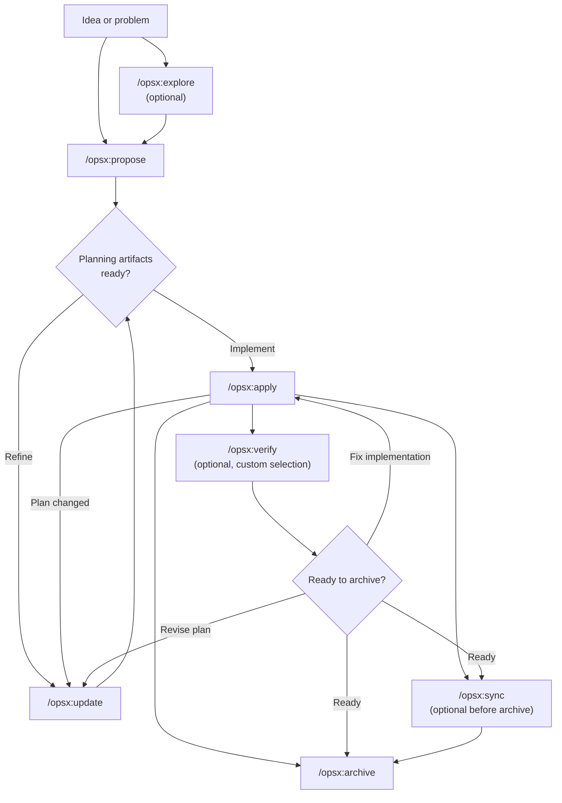
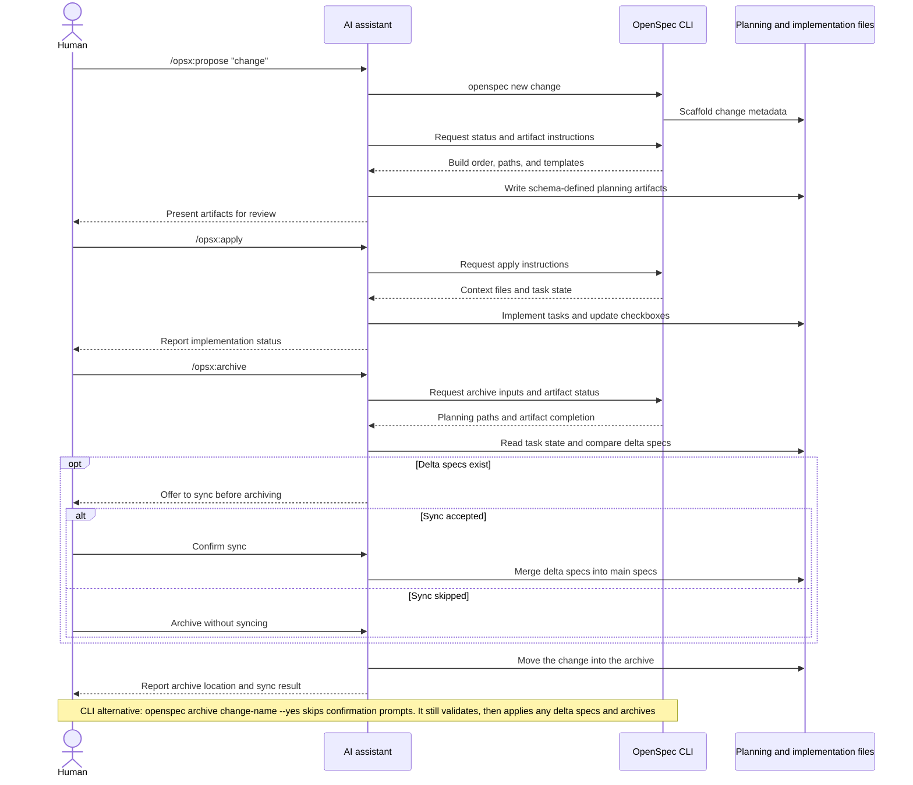

Este guia apresenta padrões comuns de fluxo de trabalho no OpenSpec e explica
quando usar cada um. Para a configuração básica, consulte
[Primeiros passos](/pt-BR/getting-started/). Para a referência de comandos,
consulte [Comandos](/pt-BR/commands/).

## Filosofia: ações, não fases

Fluxos de trabalho tradicionais obrigam você a passar por fases: planejamento,
implementação e, por fim, conclusão. Mas o trabalho real não cabe tão bem em
caixinhas.

O OPSX adota outra abordagem:

```text
Traditional (phase-locked):

  PLANNING ────────► IMPLEMENTING ────────► DONE
      │                    │
      │   "Can't go back"  │
      └────────────────────┘

OPSX (fluid actions):

  proposal ──► specs ──► design ──► tasks ──► implement
```

**Princípios principais:**

- **Ações, não fases** — os comandos são coisas que você pode fazer, não etapas em que fica preso
- **Dependências viabilizam o trabalho** — mostram o que é possível fazer, não o que é obrigatório fazer em seguida

> **Personalização:** os fluxos de trabalho do OPSX são controlados por schemas
> que definem sequências de artefatos. Consulte
> [Personalização](/pt-BR/customization/) para saber como criar schemas próprios.

## Visão geral do fluxo de trabalho

O fluxo de trabalho padrão é flexível: exploração e verificação são opcionais,
e você pode atualizar os artefatos de planejamento sempre que a implementação
revelar algo novo.



O assistente de IA conduz o fluxo de trabalho, enquanto a CLI fornece a
estrutura inicial, o status e as instruções dos artefatos de forma determinística:



## Dois modos

### Caminho rápido padrão (perfil `core`)

Novas instalações usam por padrão o perfil `core`, que disponibiliza:
- `/opsx:explore`
- `/opsx:propose`
- `/opsx:apply`
- `/opsx:update`
- `/opsx:sync`
- `/opsx:archive`

Fluxo típico:

```text
/opsx:explore ──► /opsx:propose ──► /opsx:apply ──► /opsx:sync ──► /opsx:archive
  (optional)
```

#### Comece explorando (um hábito que vale a pena criar)

`/opsx:explore` faz parte do perfil padrão; não é um recurso avançado opcional.
Use-o quando tiver um problema, mas ainda não tiver um plano — o que, ao
trabalhar com um assistente de IA, acontece na maior parte das vezes.

```text
You: /opsx:explore

AI:  What would you like to explore?

You: Our search results feel stale. I'm not sure if it's caching,
     indexing, or the query itself.

AI:  Let me look... [reads the search service and cache layer]
     It's the index: it only rebuilds nightly, so edits don't show
     up until the next day. Two options: rebuild on write (simple,
     more load) or a short-TTL cache invalidation (more moving parts,
     less load). Given your write volume is low, rebuild-on-write is
     the cleaner fix. Want to scope it?

You: Yes.

You: /opsx:propose rebuild-search-index-on-write
```

O modo de exploração nunca escreve código nem altera qualquer outra coisa, a
menos que você peça ou aceite uma sugestão. É uma conversa livre, sem
compromisso, que transforma uma preocupação vaga em uma mudança precisa e
resulta em uma proposta mais clara. Já sabe exatamente o que quer? Pule essa
etapa e vá direto para `/opsx:propose`. Guia completo:
[Comece explorando](/pt-BR/explore/).

### Fluxo de trabalho expandido/completo (seleção personalizada)

Se quiser comandos explícitos para criar a estrutura e desenvolver (`/opsx:new`,
`/opsx:continue`, `/opsx:ff`, `/opsx:verify`, `/opsx:bulk-archive`,
`/opsx:onboard`), habilite-os com:

```bash
openspec config profile
openspec update
```

## Padrões de fluxo de trabalho (modo expandido)

### Funcionalidade rápida

Quando você já sabe o que quer criar e só precisa executar:

```text
/opsx:new ──► /opsx:ff ──► /opsx:apply ──► /opsx:verify ──► /opsx:archive
```

**Exemplo de conversa:**

```text
You: /opsx:new add-logout-button

AI:  Created openspec/changes/add-logout-button/
     Ready to create: proposal

You: /opsx:ff

AI:  Creating all planning artifacts...
     ✓ proposal.md
     ✓ specs/
     ✓ design.md
     ✓ tasks.md
     Ready for implementation!

You: /opsx:apply

AI:  Working through tasks...
     ✓ Added logout button to header
     ✓ Implemented session clearing
     ✓ Added confirmation dialog
     All tasks complete!

You: /opsx:archive

AI:  ✓ Merged specs
     ✓ Archived change
```

**Ideal para:** funcionalidades pequenas ou médias, correções de bugs e
mudanças simples.

### Exploração

Quando os requisitos não estão claros ou você precisa investigar antes:

```text
/opsx:explore ──► /opsx:new ──► /opsx:continue ──► ... ──► /opsx:apply
```

**Exemplo de conversa:**

```text
You: /opsx:explore

AI:  What would you like to explore?

You: I want to improve page load performance but I'm not sure
     where the bottlenecks are.

AI:  Let me help investigate...
     [Analyzes bundle sizes, identifies slow queries, reviews
     component render patterns]

     I found three main bottlenecks:
     1. Large unoptimized images
     2. Synchronous data fetching in ProductList
     3. Re-renders from context changes

     Which would you like to address first?

You: Let's tackle the data fetching issue.

You: /opsx:new optimize-product-list-fetching

AI:  Created change. Ready to create: proposal

You: /opsx:continue

AI:  Creating proposal based on our exploration...
     [Writes proposal incorporating investigation insights]

     Ready to create: specs, design
     Which would you like next?

You: /opsx:continue

AI:  Creating specs...
```

**Ideal para:** otimização de desempenho, depuração, decisões arquiteturais e
requisitos pouco claros.

### Mudanças em paralelo

Trabalhe em várias mudanças ao mesmo tempo:

```text
Change A: /opsx:new ──► /opsx:ff ──► /opsx:apply (in progress)
                                         │
                                    context switch
                                         │
Change B: /opsx:new ──► /opsx:ff ──────► /opsx:apply
```

**Exemplo de conversa:**

```text
You: I'm working on add-dark-mode but got pulled into a bug fix

You: /opsx:new fix-login-redirect

AI:  Created openspec/changes/fix-login-redirect/

You: /opsx:ff

AI:  ✓ Created planning artifacts

You: /opsx:apply

AI:  Working on fix-login-redirect...
     [Implements the fix]
     All tasks complete!

You: /opsx:archive

AI:  ✓ Archived fix-login-redirect

You: Let's get back to dark mode

You: /opsx:apply add-dark-mode

AI:  Resuming add-dark-mode...
     Picking up at task 2.3: Update Header...
```

**Ideal para:** frentes de trabalho paralelas, interrupções urgentes e
colaboração em equipe.

Quando houver várias mudanças concluídas, use `/opsx:bulk-archive`:

```text
You: /opsx:bulk-archive

AI:  Found 3 completed changes:
     - add-dark-mode (all tasks done)
     - fix-login-redirect (all tasks done)
     - update-footer (all tasks done)

     Checking for spec conflicts...
     ⚠ add-dark-mode and update-footer both touch specs/ui/

     Inspecting codebase to resolve...
     Both changes are implemented. Will apply in chronological order.

     Archive all 3 changes?

You: Yes

AI:  ✓ Archived add-dark-mode
     ✓ Archived fix-login-redirect
     ✓ Archived update-footer
     Specs merged in order: add-dark-mode → update-footer
```

O arquivamento em lote detecta quando várias mudanças alteram as mesmas
especificações e resolve conflitos verificando o que foi realmente implementado.

### Concluir uma mudança

Fluxo recomendado para conclusão:

```text
/opsx:apply ──► /opsx:verify ──► /opsx:archive
                    │                 │
              validates          prompts to sync
              implementation     if needed
```

#### Verificar: confira seu trabalho

`/opsx:verify` valida a implementação em relação aos artefatos em três dimensões:

```text
You: /opsx:verify

AI:  Verifying add-auth...

     COMPLETENESS
     ✓ All 12 tasks in tasks.md are checked
     ✓ All requirements in specs have corresponding code
     ⚠ Scenario "Session timeout after inactivity" not tested

     CORRECTNESS
     ✓ Implementation matches spec intent
     ✓ Edge cases from scenarios are handled
     ✓ Error states match spec definitions

     COHERENCE
     ✓ Design decisions reflected in code structure
     ✓ Naming conventions consistent with design.md
     ⚠ Design mentions "event-driven" but implementation uses polling

     SUMMARY
     ─────────────────────────────
     Critical issues: 0
     Warnings: 2
     Ready to archive: Yes (with warnings)

     Recommendations:
     1. Add test for session timeout scenario
     2. Consider refactoring to event-driven as designed, or update design.md
```

**O que a verificação analisa:**

| Dimensão | O que valida |
|-----------|------------------|
| Completude | Todas as tarefas concluídas, todos os requisitos implementados e cenários cobertos |
| Correção | Implementação de acordo com a intenção da especificação e tratamento dos casos extremos |
| Coerência | Decisões de projeto refletidas no código e padrões consistentes |

A verificação não impede o arquivamento, mas revela problemas que talvez você
queira resolver antes.

#### Arquivar: finalize a mudança

`/opsx:archive` conclui a mudança e a move para o arquivo:

```text
You: /opsx:archive

AI:  Archiving add-auth...

     Artifact status:
     ✓ proposal.md exists
     ✓ specs/ exists
     ✓ design.md exists
     ✓ tasks.md exists (12/12 tasks complete)

     Delta specs: Not yet synced to main
     → Would you like to sync now?

You: Yes

AI:  ✓ Synced specs to openspec/specs/auth/spec.md
     ✓ Moved to openspec/changes/archive/2025-01-24-add-auth/

     Change archived successfully.
```

O arquivamento pergunta se as especificações ainda não foram sincronizadas. Ele
não bloqueia mudanças com tarefas incompletas, mas exibe um aviso.

## Quando usar cada opção

### `/opsx:ff` ou `/opsx:continue`

| Situação | Use |
|-----------|-----|
| Requisitos claros, pronto para desenvolver | `/opsx:ff` |
| Explorando e querendo revisar cada etapa | `/opsx:continue` |
| Quer iterar na proposta antes das especificações | `/opsx:continue` |
| Prazo apertado, é preciso avançar rápido | `/opsx:ff` |
| Mudança complexa, você quer ter controle | `/opsx:continue` |

**Regra geral:** se você consegue descrever todo o escopo de antemão, use
`/opsx:ff`. Se ainda está descobrindo o que fazer, use `/opsx:continue`.

### Quando atualizar ou começar do zero

Uma dúvida comum: quando é melhor atualizar uma mudança existente e quando se
deve começar outra?

**Atualize a mudança existente quando:**

- A intenção é a mesma, mas a execução foi refinada
- O escopo diminui (primeiro o MVP, o restante depois)
- São correções com base em novas descobertas (a base de código não era como você esperava)
- O projeto precisa de ajustes devido ao que foi descoberto na implementação

**Comece uma nova mudança quando:**

- A intenção mudou fundamentalmente
- O escopo cresceu e passou a tratar de outro trabalho
- A mudança original pode ser concluída por si só
- As alterações causariam mais confusão do que clareza

```text
                     ┌─────────────────────────────────────┐
                     │     É o mesmo trabalho?             │
                     └──────────────┬──────────────────────┘
                                    │
                 ┌──────────────────┼──────────────────┐
                 │                  │                  │
                 ▼                  ▼                  ▼
          Mesma intenção?   >50% de sobreposição? A original pode
          Mesmo problema?   Mesmo escopo?         ser concluída sem
                 │                  │             essas mudanças?
                 │                  │                  │
       ┌────────┴────────┐  ┌──────┴──────┐   ┌───────┴───────┐
       │                 │  │             │   │               │
      YES               NO YES           NO  NO              YES
       │                 │  │             │   │               │
       ▼                 ▼  ▼             ▼   ▼               ▼
   ATUALIZAR         NOVA   ATUALIZAR   NOVA ATUALIZAR        NOVA
```

**Exemplo: “Adicionar modo escuro”**

- “Também precisamos aceitar temas personalizados” → nova mudança (o escopo cresceu)
- “Detectar a preferência do sistema é mais difícil do que o esperado” → atualizar (a intenção é a mesma)
- “Vamos lançar a alternância primeiro e adicionar as preferências depois” → atualizar, arquivar e então criar uma nova mudança

## Boas práticas

### Mantenha o foco das mudanças

Mantenha uma unidade lógica de trabalho por mudança. Se for “adicionar o
recurso X e também refatorar Y”, considere criar duas mudanças separadas.

**Por que isso importa:**
- Fica mais fácil revisar e entender
- O histórico de arquivamento fica mais organizado
- As mudanças podem ser entregues independentemente
- A reversão fica mais simples, se necessária

### Use `/opsx:explore` quando os requisitos não estiverem claros

Antes de se comprometer com uma mudança, explore o problema:

```text
You: /opsx:explore

AI:  What would you like to explore?

You: How should we handle rate limiting for our API?

AI:  Let me investigate your current setup and options...
     [Researches codebase, considers patterns]

     I see three approaches we could take:
     1. Middleware-based (simple, per-endpoint)
     2. Redis-backed (scalable, shared state)
     3. Token bucket per user (fair, complex)

     Your current stack suggests #1 or #2. What's your scale?
```

A exploração esclarece as ideias antes que qualquer código seja escrito.

### Verifique antes de arquivar

Use `/opsx:verify` para conferir se a implementação corresponde aos artefatos:

```text
You: /opsx:verify

AI:  Verifying add-dark-mode...

     ✓ All tasks in tasks.md are checked
     ✓ Requirements in specs have corresponding code
     ✓ Design decisions are reflected in implementation

     Ready to archive!
```

Identifique divergências antes de concluir a mudança.

### Dê nomes claros às mudanças

Bons nomes tornam `openspec list` mais útil:

```text
Prefira:                       Evite:
add-dark-mode                  feature-1
fix-login-redirect             update
optimize-product-query         changes
implement-2fa                  wip
```

## Referência rápida dos comandos

Para obter detalhes e conhecer as opções dos comandos, consulte
[Comandos](/pt-BR/commands/).

| Comando | Finalidade | Quando usar |
|---------|---------|-------------|
| `/opsx:propose` | Criar mudança e artefatos de planejamento | Caminho rápido padrão (perfil `core`) |
| `/opsx:explore` | Refletir sobre ideias com a IA | Comece aqui se estiver em dúvida: requisitos pouco claros, investigação ou comparação de opções |
| `/opsx:new` | Criar a estrutura de uma mudança | Modo expandido, controle explícito de artefatos |
| `/opsx:continue` | Criar o próximo artefato | Modo expandido, criação de artefatos etapa por etapa |
| `/opsx:ff` | Criar todos os artefatos de planejamento | Modo expandido, escopo definido |
| `/opsx:apply` | Implementar tarefas | Quando estiver pronto para escrever código |
| `/opsx:verify` | Validar a implementação | Modo expandido, antes do arquivamento |
| `/opsx:sync` | Mesclar especificações delta | Modo expandido, opcional |
| `/opsx:archive` | Concluir a mudança | Quando todo o trabalho estiver concluído |
| `/opsx:bulk-archive` | Arquivar várias mudanças | Modo expandido, trabalho em paralelo |

## Próximos passos

- [Escrevendo boas especificações](/pt-BR/writing-specs/) — como devem ser bons requisitos e cenários, e como dimensionar uma mudança
- [Revisando uma mudança](/pt-BR/reviewing-changes/) — revisão de dois minutos de um plano antes de escrever código
- [OpenSpec em equipe](/pt-BR/team-workflow/) — como as mudanças se encaixam em branches e pull requests
- [Comandos](/pt-BR/commands/) — referência completa dos comandos e suas opções
- [Conceitos](/pt-BR/concepts/) — detalhes sobre especificações, artefatos e schemas
- [Personalização](/pt-BR/customization/) — criação de fluxos de trabalho personalizados
