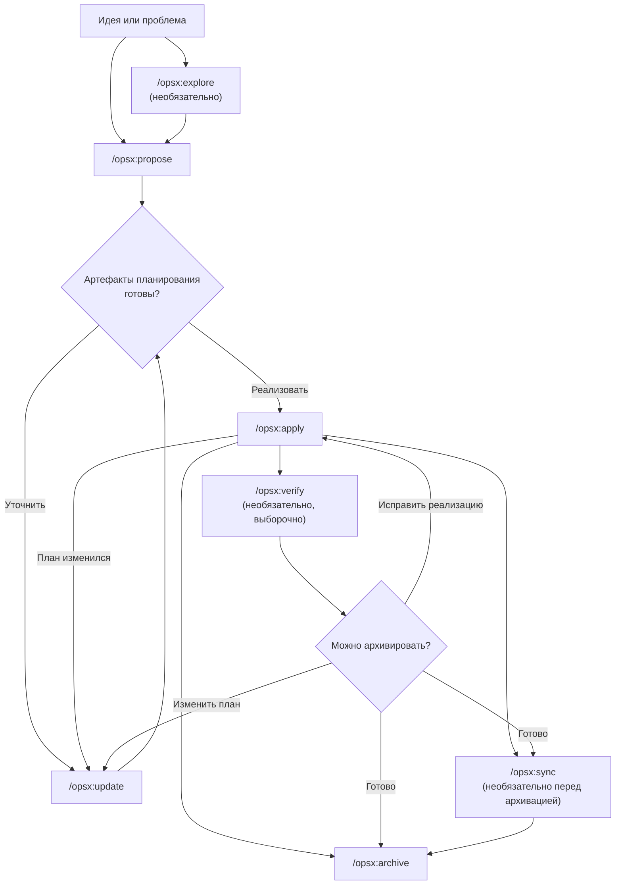
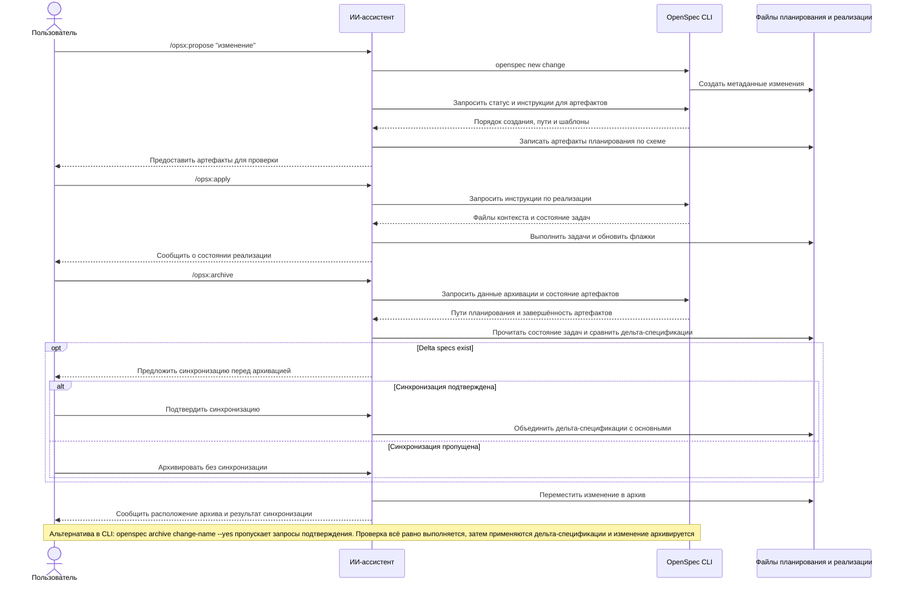

В этом руководстве описаны распространённые рабочие процессы OpenSpec и случаи их применения. Основные сведения по настройке см. в разделе [Начало работы](/ru-RU/getting-started/), а справочник команд — в разделе [Команды](/ru-RU/commands/).

## Принцип: действия, а не этапы

Традиционные рабочие процессы навязывают этапы: сначала планирование, затем реализация и завершение. Но реальная работа не укладывается в такие рамки.

В OPSX используется другой подход:

```text
Традиционный (с фиксированными этапами):

  ПЛАНИРОВАНИЕ ───► РЕАЛИЗАЦИЯ ──────────► ГОТОВО
      │                    │
      │   «Нельзя вернуться» │
      └────────────────────┘

OPSX (гибкие действия):

  proposal ──► specs ──► design ──► tasks ──► implement
```

**Основные принципы:**

- **Действия, а не этапы** — команды выполняют конкретные задачи, а не переводят вас на следующий обязательный этап.
- **Зависимости — опоры** — они показывают, что можно сделать, а не что обязательно делать следующим.

> **Настройка:** рабочие процессы OPSX управляются схемами, задающими последовательность артефактов. Сведения о создании пользовательских схем см. в разделе [Настройка](/ru-RU/customization/).

## Рабочий процесс вкратце

Рабочий процесс по умолчанию остаётся гибким: исследование и проверка необязательны,
а артефакты планирования можно обновить, если в ходе реализации обнаружится что-то новое.



ИИ-ассистент управляет рабочим процессом, а CLI предсказуемо создаёт каркас,
показывает состояние и инструкции для артефактов:



## Два режима

### Быстрый путь по умолчанию (профиль `core`)

В новых установках по умолчанию используется `core`, предоставляющий команды:
- `/opsx:explore`
- `/opsx:propose`
- `/opsx:apply`
- `/opsx:update`
- `/opsx:sync`
- `/opsx:archive`

Типичный процесс:

```text
/opsx:explore ──► /opsx:propose ──► /opsx:apply ──► /opsx:sync ──► /opsx:archive
  (optional)
```

#### Начните с исследования (полезная привычка)

`/opsx:explore` входит в профиль по умолчанию, это не дополнительная функция для опытных пользователей. Запускайте её, когда проблема уже есть, а плана ещё нет — при работе с ИИ-ассистентом так бывает чаще всего.

```text
Вы: /opsx:explore

ИИ:  Что вы хотели бы исследовать?

Вы: Результаты поиска кажутся устаревшими. Не уверен, виновато ли
    кэширование, индексация или сам запрос.

ИИ:  Сейчас посмотрю... [изучает службу поиска и уровень кэширования]
     Проблема в индексе: он перестраивается только ночью, поэтому
     изменения отображаются лишь на следующий день. Есть два варианта:
     перестраивать при записи (проще, но выше нагрузка) или аннулировать
     кэш с коротким TTL (сложнее, но ниже нагрузка). При небольшом
     количестве записей лучше перестраивать индекс при записи.
     Подготовить план?

Вы: Да.

You: /opsx:propose rebuild-search-index-on-write
```

Explore никогда не пишет код и ничего не записывает, если вы не попросите или не согласитесь на её предложение. Это свободное обсуждение без обязательств, которое превращает смутное опасение в точное изменение. Благодаря этому последующее предложение получается чётким. Уже точно знаете, чего хотите? Пропустите исследование и сразу запустите `/opsx:propose`. Полное руководство: [Сначала исследуйте](/ru-RU/explore/).

### Расширенный/полный рабочий процесс (пользовательский выбор)

Чтобы использовать явные команды создания каркаса и работы (`/opsx:new`, `/opsx:continue`, `/opsx:ff`, `/opsx:verify`, `/opsx:bulk-archive`, `/opsx:onboard`), включите их командами:

```bash
openspec config profile
openspec update
```

## Шаблоны рабочих процессов (расширенный режим)

### Быстрая разработка функции

Если вы знаете, что нужно создать, и хотите просто приступить к работе:

```text
/opsx:new ──► /opsx:ff ──► /opsx:apply ──► /opsx:verify ──► /opsx:archive
```

**Пример диалога:**

```text
Вы: /opsx:new add-logout-button

ИИ:  Создана папка openspec/changes/add-logout-button/
     Готово к созданию: proposal

Вы: /opsx:ff

ИИ:  Создаю все артефакты планирования...
     ✓ proposal.md
     ✓ specs/
     ✓ design.md
     ✓ tasks.md
     Готово к реализации!

Вы: /opsx:apply

ИИ:  Выполняю задачи...
     ✓ Добавлена кнопка выхода в заголовок
     ✓ Реализовано завершение сеанса
     ✓ Добавлен диалог подтверждения
     Все задачи выполнены!

Вы: /opsx:archive

ИИ:  ✓ Спецификации объединены
     ✓ Изменение архивировано
```

**Лучше всего подходит для:** небольших и средних функций, исправлений ошибок и простых изменений.

### Исследовательский процесс

Если требования неясны или сначала нужно провести исследование:

```text
/opsx:explore ──► /opsx:new ──► /opsx:continue ──► ... ──► /opsx:apply
```

**Пример диалога:**

```text
Вы: /opsx:explore

ИИ:  Что вы хотели бы исследовать?

Вы: Я хочу ускорить загрузку страниц, но не знаю, где возникают
    узкие места.

ИИ:  Давайте исследуем...
     [анализирует размер сборки, находит медленные запросы и изучает
     особенности отрисовки компонентов]

     Найдены три основных узких места:
     1. Большие неоптимизированные изображения
     2. Синхронное получение данных в ProductList
     3. Повторные отрисовки из-за изменений контекста

     С чего вы хотели бы начать?

Вы: Давайте займёмся получением данных.

Вы: /opsx:new optimize-product-list-fetching

ИИ:  Изменение создано. Готово к созданию: proposal

Вы: /opsx:continue

ИИ:  Создаю предложение на основе исследования...
     [составляет предложение с учётом полученных данных]

     Готово к созданию: specs, design
     Что создать следующим?

Вы: /opsx:continue

ИИ:  Создаю спецификации...
```

**Лучше всего подходит для:** оптимизации производительности, отладки, архитектурных решений и неясных требований.

### Параллельные изменения

Работа над несколькими изменениями одновременно:

```text
Change A: /opsx:new ──► /opsx:ff ──► /opsx:apply (in progress)
                                         │
                                    переключение контекста
                                         │
Change B: /opsx:new ──► /opsx:ff ──────► /opsx:apply
```

**Пример диалога:**

```text
Вы: Я работаю над add-dark-mode, но меня отвлекло исправление ошибки.

Вы: /opsx:new fix-login-redirect

ИИ:  Создана папка openspec/changes/fix-login-redirect/

Вы: /opsx:ff

ИИ:  ✓ Артефакты планирования созданы

Вы: /opsx:apply

ИИ:  Работаю над fix-login-redirect...
     [реализует исправление]
     Все задачи выполнены!

Вы: /opsx:archive

ИИ:  ✓ fix-login-redirect архивировано

Вы: Вернёмся к тёмной теме.

Вы: /opsx:apply add-dark-mode

ИИ:  Возобновляю add-dark-mode...
     Продолжаю с задачи 2.3: обновить Header...
```

**Лучше всего подходит для:** параллельных задач, срочных отвлечений и командной работы.

Если завершено несколько изменений, используйте `/opsx:bulk-archive`:

```text
Вы: /opsx:bulk-archive

ИИ:  Найдено 3 завершённых изменения:
     - add-dark-mode (все задачи выполнены)
     - fix-login-redirect (все задачи выполнены)
     - update-footer (все задачи выполнены)

     Проверяю конфликты спецификаций...
     ⚠ add-dark-mode и update-footer оба изменяют specs/ui/

     Изучаю кодовую базу для разрешения...
     Оба изменения реализованы. Применю их в хронологическом порядке.

     Архивировать все три изменения?

Вы: Да.

ИИ:  ✓ add-dark-mode архивировано
     ✓ fix-login-redirect архивировано
     ✓ update-footer архивировано
     Спецификации объединены в таком порядке: add-dark-mode → update-footer
```

Команда bulk-archive обнаруживает изменения, затрагивающие одни и те же спецификации, и разрешает конфликты, проверяя, что действительно реализовано.

### Завершение изменения

Рекомендуемая последовательность завершения:

```text
/opsx:apply ──► /opsx:verify ──► /opsx:archive
                    │                 │
              проверяет          предлагает синхронизацию
              реализацию         при необходимости
```

#### Verify: проверьте свою работу

`/opsx:verify` проверяет соответствие реализации артефактам по трём направлениям:

```text
Вы: /opsx:verify

ИИ:  Проверяю add-auth...

     ПОЛНОТА
     ✓ Отмечены все 12 задач в tasks.md
     ✓ Для всех требований в specs есть соответствующий код
     ⚠ Сценарий «завершение сеанса после бездействия» не проверен

     КОРРЕКТНОСТЬ
     ✓ Реализация соответствует цели спецификации
     ✓ Учтены граничные случаи из сценариев
     ✓ Состояния ошибок соответствуют спецификациям

     СОГЛАСОВАННОСТЬ
     ✓ Проектные решения отражены в структуре кода
     ✓ Именование соответствует design.md
     ⚠ В проектном решении указана «обработка событий», а в реализации используется опрос

     ИТОГ
     ─────────────────────────────
     Критические проблемы: 0
     Предупреждения: 2
     Готово к архивации: да (с предупреждениями)

     Рекомендации:
     1. Добавить тест для сценария завершения сеанса
     2. Перейти на обработку событий, как указано в проектном решении, или обновить design.md
```

**Что проверяет verify:**

| Направление | Что проверяется |
|-----------|------------------|
| Полнота | Выполнены все задачи, реализованы все требования, сценарии учтены |
| Корректность | Реализация соответствует цели спецификации, граничные случаи обработаны |
| Согласованность | Проектные решения отражены в коде, шаблоны согласованы |

Команда verify не блокирует архивацию, но показывает проблемы, которые, возможно, стоит устранить заранее.

#### Archive: завершите изменение

`/opsx:archive` завершает изменение и перемещает его в архив:

```text
Вы: /opsx:archive

ИИ:  Архивирую add-auth...

     Состояние артефактов:
     ✓ proposal.md существует
     ✓ specs/ существует
     ✓ design.md существует
     ✓ tasks.md существует (выполнено 12 из 12 задач)

     Дельта-спецификации ещё не синхронизированы с основными
     → Синхронизировать сейчас?

Вы: Да.

ИИ:  ✓ Спецификации синхронизированы с openspec/specs/auth/spec.md
     ✓ Перемещено в openspec/changes/archive/2025-01-24-add-auth/

     Изменение успешно архивировано.
```

Если спецификации не синхронизированы, archive предложит сделать это. Невыполненные задачи не блокируют архивацию, но о них будет выведено предупреждение.

## Что и когда использовать

### `/opsx:ff` или `/opsx:continue`

| Ситуация | Команда |
|-----------|-----|
| Требования ясны, можно приступать к реализации | `/opsx:ff` |
| Идёт исследование, нужно проверять каждый шаг | `/opsx:continue` |
| Нужно доработать предложение до создания спецификаций | `/opsx:continue` |
| Мало времени, нужно действовать быстро | `/opsx:ff` |
| Сложное изменение, нужен контроль | `/opsx:continue` |

**Практическое правило:** если вы можете сразу описать весь объём работ, используйте `/opsx:ff`. Если задача проясняется по ходу работы, используйте `/opsx:continue`.

### Когда обновить изменение, а когда начать заново

Часто спрашивают, когда следует обновить существующее изменение, а когда лучше создать новое.

**Обновите существующее изменение, если:**

- цель не изменилась, но уточняется способ реализации;
- область работ сузилась (сначала MVP, остальное позже);
- нужно внести исправления с учётом полученных знаний (кодовая база оказалась не такой, как ожидалось);
- проектное решение нужно скорректировать с учётом находок при реализации.

**Создайте новое изменение, если:**

- цель принципиально изменилась;
- область работ разрослась и превратилась в другую задачу;
- исходное изменение можно считать завершённым отдельно;
- дополнительные правки скорее запутают, чем прояснят ситуацию.

```text
                     ┌─────────────────────────────────────┐
                     │   Это та же самая работа?           │
                     └──────────────┬──────────────────────┘
                                    │
                 ┌──────────────────┼──────────────────┐
                 │                  │                  │
                 ▼                  ▼                  ▼
        Та же цель?    Совпадение >50%?    Можно завершить
        Та же проблема? Та же область?     исходную работу без
                 │                  │    этих изменений?
                 │                  │                  │
       ┌────────┴────────┐  ┌──────┴──────┐   ┌───────┴───────┐
       │                 │  │             │   │               │
      YES               NO YES           NO  NO              YES
       │                 │  │             │   │               │
       ▼                 ▼  ▼             ▼   ▼               ▼
    ОБНОВИТЬ          НОВОЕ ОБНОВИТЬ    НОВОЕ ОБНОВИТЬ        НОВОЕ
```

**Пример: «Добавить тёмную тему»**

- «Ещё нужна поддержка пользовательских тем» → новое изменение (объём разросся).
- «Определить системные предпочтения сложнее, чем ожидалось» → обновить изменение (цель та же).
- «Сначала выпустим переключатель, а предпочтения добавим позже» → обновить и архивировать изменение, затем создать новое.

## Рекомендации

### Не размывайте границы изменений

Одно изменение должно соответствовать одной логической единице работы. Если вы «добавляете функцию X и одновременно проводите рефакторинг Y», подумайте о том, чтобы разделить эту работу на два изменения.

**Почему это важно:**
- изменения проще проверять и понимать;
- история архива чище;
- части работы можно выпускать независимо;
- при необходимости проще выполнить откат.

### Используйте `/opsx:explore`, если требования неясны

Прежде чем принимать решение об изменении, исследуйте проблему:

```text
Вы: /opsx:explore

ИИ:  Что вы хотели бы исследовать?

Вы: Как лучше ограничить частоту запросов к нашему API?

ИИ:  Изучу текущую конфигурацию и варианты...
     [изучает кодовую базу и рассматривает возможные шаблоны]

     Вижу три возможных подхода:
     1. На основе промежуточного ПО (просто, отдельно для каждого эндпоинта)
     2. На основе Redis (масштабируемо, общее состояние)
     3. Отдельный токен-бакет для пользователя (справедливо, но сложно)

     Ваш стек позволяет использовать варианты № 1 или № 2. Какова ожидаемая нагрузка?
```

Исследование помогает прояснить задачу до написания кода.

### Проверяйте перед архивацией

Используйте `/opsx:verify`, чтобы убедиться, что реализация соответствует артефактам:

```text
Вы: /opsx:verify

ИИ:  Проверяю add-dark-mode...

     ✓ Все задачи в tasks.md отмечены
     ✓ Для требований в specs есть соответствующий код
     ✓ Проектные решения отражены в реализации

     Готово к архивации!
```

Так вы обнаружите несоответствия до завершения изменения.

### Давайте изменениям понятные имена

Понятные имена делают `openspec list` полезной командой:

```text
Хорошо:                        Неудачно:
add-dark-mode                  feature-1
fix-login-redirect             update
optimize-product-query         changes
implement-2fa                  wip
```

## Краткий справочник команд

Подробное описание команд и параметров см. в разделе [Команды](/ru-RU/commands/).

| Команда | Назначение | Когда использовать |
|---------|---------|-------------|
| `/opsx:propose` | Создать изменение и артефакты планирования | Быстрый путь по умолчанию (профиль `core`) |
| `/opsx:explore` | Обдумать идеи вместе с ИИ | Начните отсюда, если не уверены: неясные требования, исследование, сравнение вариантов |
| `/opsx:new` | Создать каркас изменения | Расширенный режим, явный контроль артефактов |
| `/opsx:continue` | Создать следующий артефакт | Расширенный режим, пошаговое создание артефактов |
| `/opsx:ff` | Создать все артефакты планирования | Расширенный режим, область работ определена |
| `/opsx:apply` | Реализовать задачи | Когда можно писать код |
| `/opsx:verify` | Проверить реализацию | Расширенный режим, перед архивацией |
| `/opsx:sync` | Объединить дельта-спецификации | Расширенный режим, необязательно |
| `/opsx:archive` | Завершить изменение | Вся работа выполнена |
| `/opsx:bulk-archive` | Архивировать несколько изменений | Расширенный режим, параллельная работа |

## Следующие шаги

- [Как писать хорошие спецификации](/ru-RU/writing-specs/) — требования и сценарии, которые стоит использовать, и выбор подходящего размера изменения
- [Проверка изменения](/ru-RU/reviewing-changes/) — двухминутная проверка плана до написания кода
- [OpenSpec в команде](/ru-RU/team-workflow/) — как изменения связаны с ветками и пул-реквестами
- [Команды](/ru-RU/commands/) — полный справочник команд и параметров
- [Основные понятия](/ru-RU/concepts/) — подробное описание спецификаций, артефактов и схем
- [Настройка](/ru-RU/customization/) — создание пользовательских рабочих процессов
