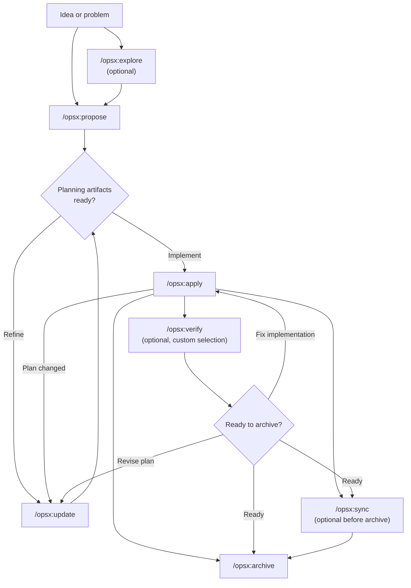
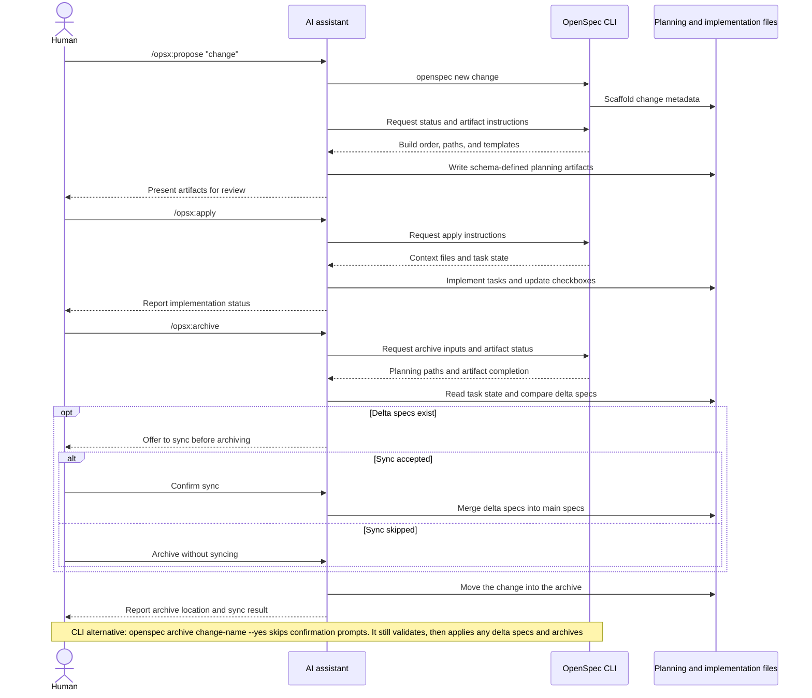

本指南介绍 OpenSpec 的常见工作流模式，以及各模式的适用场景。基本设置请参阅[快速入门](/zh-CN/getting-started/)，命令参考请参阅[命令](/zh-CN/commands/)。

## 理念：操作，而非阶段

传统工作流会强迫你依次经历各个阶段：先规划，再实现，最后完成。但真实工作并不会整齐地落在预设阶段中。

OPSX 采用不同的方式：

```text
Traditional (phase-locked):

  PLANNING ────────► IMPLEMENTING ────────► DONE
      │                    │
      │   "Can't go back"  │
      └────────────────────┘

OPSX (fluid actions):

  proposal ──► specs ──► design ──► tasks ──► implement
```

**核心原则：**

- **操作，而非阶段**——命令是可以随时执行的操作，不是会把你困住的阶段。
- **依赖关系是助力，而非关卡**——它们表示接下来可以做什么，而非必须做什么。

> **自定义：** OPSX 工作流由定义产物顺序的模式驱动。创建自定义模式的详情请参阅[自定义](/zh-CN/customization/)。

## 工作流一览

默认工作流保持灵活：探索和验证都是可选的；实现过程中有新发现时，也可以随时更新规划产物。



AI 助手负责驱动工作流，CLI 则提供确定性的脚手架、状态和产物指令：



## 两种模式

### 默认快捷路径（`core` 配置档案）

新安装默认使用 `core`，包含以下命令：

- `/opsx:explore`
- `/opsx:propose`
- `/opsx:apply`
- `/opsx:update`
- `/opsx:sync`
- `/opsx:archive`

典型流程：

```text
/opsx:explore ──► /opsx:propose ──► /opsx:apply ──► /opsx:sync ──► /opsx:archive
  (optional)
```

#### 从探索开始（值得养成的习惯）

`/opsx:explore` 属于默认配置档案，并非高级附加功能。只要你遇到了问题但尚无计划，就可以使用它；与 AI 助手协作时，这几乎是大多数时候的状态。

```text
You: /opsx:explore

AI:  What would you like to explore?

You: Our search results feel stale. I'm not sure if it's caching,
     indexing, or the query itself.

AI:  Let me look... [reads the search service and cache layer]
     It's the index: it only rebuilds nightly, so edits don't show
     up until the next day. Two options: rebuild on write (simple,
     more load) or a short-TTL cache invalidation (more moving parts,
     less load). Given your write volume is low, rebuild-on-write is
     the cleaner fix. Want to scope it?

You: Yes.

You: /opsx:propose rebuild-search-index-on-write
```

除非你主动要求，或在 Explore 提出建议时表示同意，否则它不会编写代码或写入其他内容。它是一场免费、没有风险的对话，可以将模糊担忧转化为明确变更，让后续提案更准确。如果你已经完全清楚要做什么？跳过探索，直接运行 `/opsx:propose` 即可。完整指南见[先探索](/zh-CN/explore/)。

### 扩展/完整工作流（自定义选择）

如果希望使用明确的脚手架和构建命令（`/opsx:new`、`/opsx:continue`、`/opsx:ff`、`/opsx:verify`、`/opsx:bulk-archive`、`/opsx:onboard`），请使用以下命令启用：

```bash
openspec config profile
openspec update
```

## 工作流模式（扩展模式）

### 快速实现功能

当你清楚要构建什么，只需开始执行时：

```text
/opsx:new ──► /opsx:ff ──► /opsx:apply ──► /opsx:verify ──► /opsx:archive
```

**对话示例：**

```text
You: /opsx:new add-logout-button

AI:  Created openspec/changes/add-logout-button/
     Ready to create: proposal

You: /opsx:ff

AI:  Creating all planning artifacts...
     ✓ proposal.md
     ✓ specs/
     ✓ design.md
     ✓ tasks.md
     Ready for implementation!

You: /opsx:apply

AI:  Working through tasks...
     ✓ Added logout button to header
     ✓ Implemented session clearing
     ✓ Added confirmation dialog
     All tasks complete!

You: /opsx:archive

AI:  ✓ Merged specs
     ✓ Archived change
```

**适合：** 中小型功能、bug 修复和范围明确的变更。

### 探索式流程

当需求不明确，或需要先调查时：

```text
/opsx:explore ──► /opsx:new ──► /opsx:continue ──► ... ──► /opsx:apply
```

**对话示例：**

```text
You: /opsx:explore

AI:  What would you like to explore?

You: I want to improve page load performance but I'm not sure
     where the bottlenecks are.

AI:  Let me help investigate...
     [Analyzes bundle sizes, identifies slow queries, reviews
     component render patterns]

     I found three main bottlenecks:
     1. Large unoptimized images
     2. Synchronous data fetching in ProductList
     3. Re-renders from context changes

     Which would you like to address first?

You: Let's tackle the data fetching issue.

You: /opsx:new optimize-product-list-fetching

AI:  Created change. Ready to create: proposal

You: /opsx:continue

AI:  Creating proposal based on our exploration...
     [Writes proposal incorporating investigation insights]

     Ready to create: specs, design
     Which would you like next?

You: /opsx:continue

AI:  Creating specs...
```

**适合：** 性能优化、调试、架构决策和不明确的需求。

### 并行处理变更

同时处理多个变更：

```text
Change A: /opsx:new ──► /opsx:ff ──► /opsx:apply (in progress)
                                         │
                                    context switch
                                         │
Change B: /opsx:new ──► /opsx:ff ──────► /opsx:apply
```

**对话示例：**

```text
You: I'm working on add-dark-mode but got pulled into a bug fix

You: /opsx:new fix-login-redirect

AI:  Created openspec/changes/fix-login-redirect/

You: /opsx:ff

AI:  ✓ Created planning artifacts

You: /opsx:apply

AI:  Working on fix-login-redirect...
     [Implements the fix]
     All tasks complete!

You: /opsx:archive

AI:  ✓ Archived fix-login-redirect

You: Let's get back to dark mode

You: /opsx:apply add-dark-mode

AI:  Resuming add-dark-mode...
     Picking up at task 2.3: Update Header...
```

**适合：** 并行工作流、紧急插入任务和团队协作。

如果有多项已完成的变更，可以使用 `/opsx:bulk-archive`：

```text
You: /opsx:bulk-archive

AI:  Found 3 completed changes:
     - add-dark-mode (all tasks done)
     - fix-login-redirect (all tasks done)
     - update-footer (all tasks done)

     Checking for spec conflicts...
     ⚠ add-dark-mode and update-footer both touch specs/ui/

     Inspecting codebase to resolve...
     Both changes are implemented. Will apply in chronological order.

     Archive all 3 changes?

You: Yes

AI:  ✓ Archived add-dark-mode
     ✓ Archived fix-login-redirect
     ✓ Archived update-footer
     Specs merged in order: add-dark-mode → update-footer
```

Bulk archive 会检测多项变更同时修改同一规格说明的情形，并根据实际实现情况解决冲突。

### 完成一项变更

推荐的完成流程：

```text
/opsx:apply ──► /opsx:verify ──► /opsx:archive
                    │                 │
              validates          prompts to sync
              implementation     if needed
```

#### Verify：检查工作

`/opsx:verify` 会从三个维度对照产物检查实现：

```text
You: /opsx:verify

AI:  Verifying add-auth...

     COMPLETENESS
     ✓ All 12 tasks in tasks.md are checked
     ✓ All requirements in specs have corresponding code
     ⚠ Scenario "Session timeout after inactivity" not tested

     CORRECTNESS
     ✓ Implementation matches spec intent
     ✓ Edge cases from scenarios are handled
     ✓ Error states match spec definitions

     COHERENCE
     ✓ Design decisions reflected in code structure
     ✓ Naming conventions consistent with design.md
     ⚠ Design mentions "event-driven" but implementation uses polling

     SUMMARY
     ─────────────────────────────
     Critical issues: 0
     Warnings: 2
     Ready to archive: Yes (with warnings)

     Recommendations:
     1. Add test for session timeout scenario
     2. Consider refactoring to event-driven as designed, or update design.md
```

**Verify 的检查内容：**

| 维度 | 验证内容 |
|-----------|------------------|
| 完整性 | 所有任务是否完成、所有需求是否实现、场景是否覆盖 |
| 正确性 | 实现是否符合规格意图、边界情况是否处理 |
| 一致性 | 设计决策是否体现在代码中、各模式是否一致 |

Verify 不会阻止归档，但会指出你可能需要先处理的问题。

#### Archive：完成变更

`/opsx:archive` 会完成变更并将其移入归档：

```text
You: /opsx:archive

AI:  Archiving add-auth...

     Artifact status:
     ✓ proposal.md exists
     ✓ specs/ exists
     ✓ design.md exists
     ✓ tasks.md exists (12/12 tasks complete)

     Delta specs: Not yet synced to main
     → Would you like to sync now?

You: Yes

AI:  ✓ Synced specs to openspec/specs/auth/spec.md
     ✓ Moved to openspec/changes/archive/2025-01-24-add-auth/

     Change archived successfully.
```

如果规格说明尚未同步，Archive 会提示你。任务尚未全部完成不会阻止归档，但会发出警告。

## 如何选择

### `/opsx:ff` 还是 `/opsx:continue`

| 情况 | 使用 |
|-----------|-----|
| 需求明确，准备开始实现 | `/opsx:ff` |
| 仍在探索，希望逐步审查 | `/opsx:continue` |
| 想先完善提案，再编写规格说明 | `/opsx:continue` |
| 时间紧迫，需要快速推进 | `/opsx:ff` |
| 变更复杂，希望掌控过程 | `/opsx:continue` |

**经验法则：** 如果你能预先描述完整范围，使用 `/opsx:ff`；如果你还在边做边梳理，使用 `/opsx:continue`。

### 何时更新，何时重新开始

常见问题是：什么时候可以更新现有变更，什么时候应该新建？

**以下情形更新现有变更：**

- 意图相同，只是执行方式更完善
- 范围缩小（先完成 MVP，其他部分稍后处理）
- 根据新发现进行修正（代码库与你预想的不同）
- 根据实现过程中的发现微调设计

**以下情形新建变更：**

- 意图发生根本变化
- 范围扩大为完全不同的工作
- 原变更可以独立标记为“完成”
- 修补只会让内容更难理解，而非更清晰

```text
                     ┌─────────────────────────────────────┐
                     │     Is this the same work?          │
                     └──────────────┬──────────────────────┘
                                    │
                 ┌──────────────────┼──────────────────┐
                 │                  │                  │
                 ▼                  ▼                  ▼
          Same intent?      >50% overlap?      Can original
          Same problem?     Same scope?        be "done" without
                 │                  │          these changes?
                 │                  │                  │
       ┌────────┴────────┐  ┌──────┴──────┐   ┌───────┴───────┐
       │                 │  │             │   │               │
      YES               NO YES           NO  NO              YES
       │                 │  │             │   │               │
       ▼                 ▼  ▼             ▼   ▼               ▼
    UPDATE            NEW  UPDATE       NEW  UPDATE          NEW
```

**示例：“添加深色模式”**

- “还要支持自定义主题” → 新建变更（范围扩大）
- “操作系统偏好检测比预想的更难” → 更新（意图相同）
- “先发布切换开关，稍后再添加偏好设置” → 更新后归档，然后新建一项变更

## 最佳实践

### 保持变更聚焦

每项变更只包含一个逻辑工作单元。如果你正在“添加功能 X，同时重构 Y”，可以考虑拆分为两项变更。

**这样做的重要性：**

- 更容易审查和理解
- 归档历史更清晰
- 可以独立发布
- 必要时更容易回滚

### 需求不明确时使用 `/opsx:explore`

确定变更方案之前，先探索问题空间：

```text
You: /opsx:explore

AI:  What would you like to explore?

You: How should we handle rate limiting for our API?

AI:  Let me investigate your current setup and options...
     [Researches codebase, considers patterns]

     I see three approaches we could take:
     1. Middleware-based (simple, per-endpoint)
     2. Redis-backed (scalable, shared state)
     3. Token bucket per user (fair, complex)

     Your current stack suggests #1 or #2. What's your scale?
```

探索能在编写任何代码之前厘清思路。

### 归档前进行验证

使用 `/opsx:verify` 检查实现是否符合产物：

```text
You: /opsx:verify

AI:  Verifying add-dark-mode...

     ✓ All tasks in tasks.md are checked
     ✓ Requirements in specs have corresponding code
     ✓ Design decisions are reflected in implementation

     Ready to archive!
```

在结束变更之前发现不一致。

### 给变更取清晰的名称

好名称能让 `openspec list` 更有用：

```text
Good:                          Avoid:
add-dark-mode                  feature-1
fix-login-redirect             update
optimize-product-query         changes
implement-2fa                  wip
```

## 命令速查

命令的完整说明和选项请参阅[命令](/zh-CN/commands/)。

| 命令 | 用途 | 适用场景 |
|---------|---------|-------------|
| `/opsx:propose` | 创建变更并生成规划产物 | 快速默认路径（`core` 配置档案） |
| `/opsx:explore` | 与 AI 一起梳理想法 | 不确定时从这里开始：需求不明、需要调查或比较方案 |
| `/opsx:new` | 创建变更脚手架 | 扩展模式，明确控制产物 |
| `/opsx:continue` | 创建下一个产物 | 扩展模式，逐步创建产物 |
| `/opsx:ff` | 创建全部规划产物 | 扩展模式，范围明确 |
| `/opsx:apply` | 实现任务 | 准备开始编写代码 |
| `/opsx:verify` | 验证实现 | 扩展模式，归档之前 |
| `/opsx:sync` | 合并差异规格说明 | 扩展模式，可选 |
| `/opsx:archive` | 完成变更 | 所有工作已完成 |
| `/opsx:bulk-archive` | 批量归档多项变更 | 扩展模式，并行工作 |

## 后续步骤

- [编写良好的规格说明](/zh-CN/writing-specs/)——了解优质需求和场景的写法，以及如何合理控制变更范围
- [审查变更](/zh-CN/reviewing-changes/)——编写代码之前，用两分钟审查起草好的计划
- [在团队中使用 OpenSpec](/zh-CN/team-workflow/)——了解变更如何融入分支和拉取请求
- [命令](/zh-CN/commands/)——包含选项的完整命令参考
- [概念](/zh-CN/concepts/)——深入了解规格说明、产物和模式
- [自定义](/zh-CN/customization/)——创建自定义工作流
