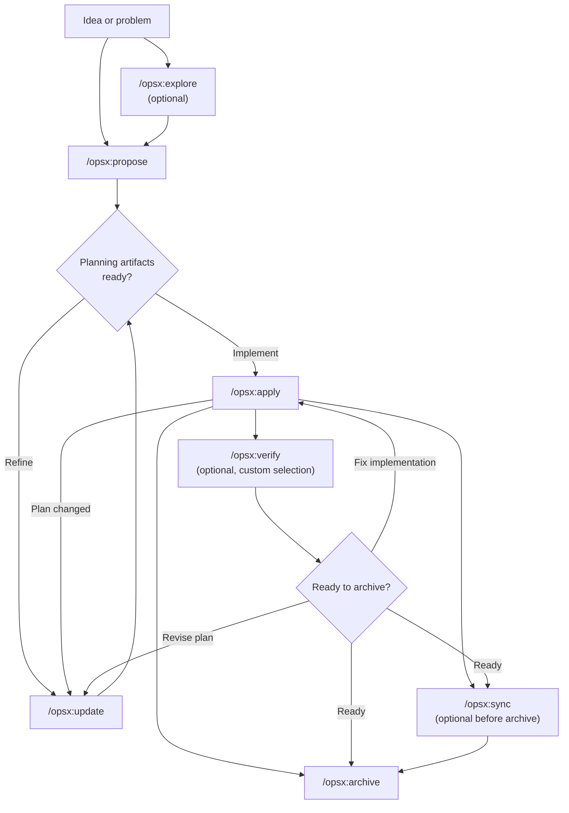
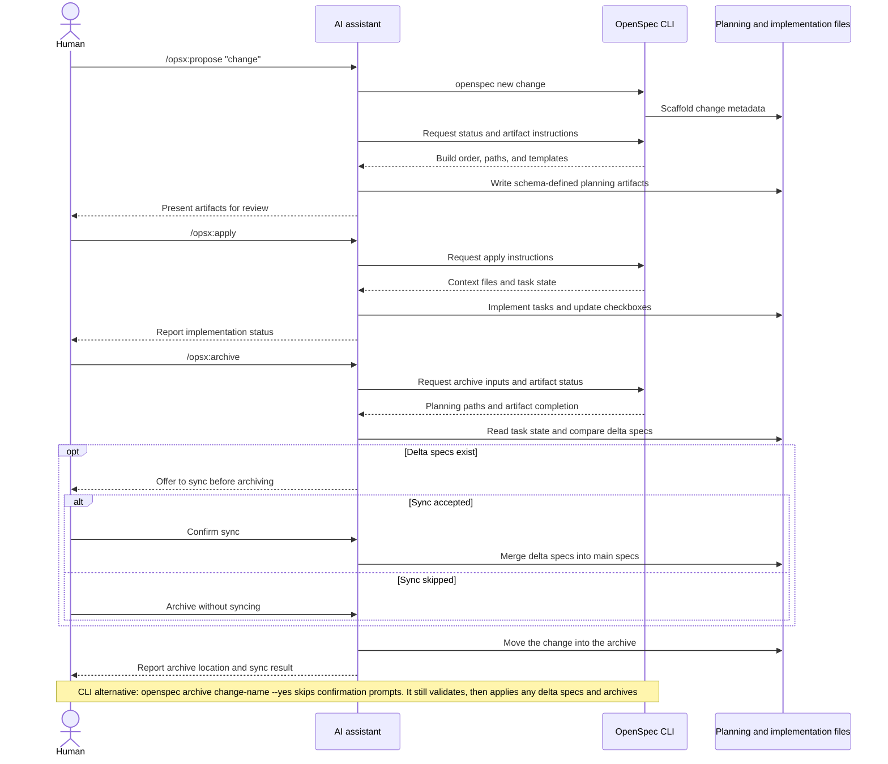

本指南介紹 OpenSpec 的常見工作流程模式，以及各模式的適用情境。基本設定請參閱[快速入門](/zh-Hant/getting-started/)，命令參考請參閱[命令](/zh-Hant/commands/)。

## 理念：操作，而非階段

傳統工作流程會強迫你依次經歷各個階段：先規劃，再實作，最後完成。但真實工作並不會整齊地落在預設階段中。

OPSX 採用不同的方式：

```text
Traditional (phase-locked):

  PLANNING ────────► IMPLEMENTING ────────► DONE
      │                    │
      │   "Can't go back"  │
      └────────────────────┘

OPSX (fluid actions):

  proposal ──► specs ──► design ──► tasks ──► implement
```

**核心原則：**

- **操作，而非階段**——命令是可以隨時執行的操作，不是會把你困住的階段。
- **依賴關係是助力，而非關卡**——它們表示接下來可以做什麼，而非必須做什麼。

> **自訂：** OPSX 工作流程由定義產物順序的模式驅動。建立自訂模式的詳情請參閱[自訂](/zh-Hant/customization/)。

## 工作流程一覽

預設工作流程保持靈活：探索和驗證都是可選的；實作過程中有新發現時，也可以隨時更新規劃產物。



AI 助手負責驅動工作流程，CLI 則提供確定性的腳手架、狀態和產物指令：



## 兩種模式

### 預設快捷路徑（`core` 設定檔案）

新安裝預設使用 `core`，包含以下命令：

- `/opsx:explore`
- `/opsx:propose`
- `/opsx:apply`
- `/opsx:update`
- `/opsx:sync`
- `/opsx:archive`

典型流程：

```text
/opsx:explore ──► /opsx:propose ──► /opsx:apply ──► /opsx:sync ──► /opsx:archive
  (optional)
```

#### 從探索開始（值得養成的習慣）

`/opsx:explore` 屬於預設設定檔案，並非高階附加功能。只要你遇到了問題但尚無計畫，就可以使用它；與 AI 助手協作時，這幾乎是大多數時候的狀態。

```text
You: /opsx:explore

AI:  What would you like to explore?

You: Our search results feel stale. I'm not sure if it's caching,
     indexing, or the query itself.

AI:  Let me look... [reads the search service and cache layer]
     It's the index: it only rebuilds nightly, so edits don't show
     up until the next day. Two options: rebuild on write (simple,
     more load) or a short-TTL cache invalidation (more moving parts,
     less load). Given your write volume is low, rebuild-on-write is
     the cleaner fix. Want to scope it?

You: Yes.

You: /opsx:propose rebuild-search-index-on-write
```

除非你主動要求，或在 Explore 提出建議時表示同意，否則它不會編寫程式碼或寫入其他內容。它是一場免費、沒有風險的對話，可以將模糊擔憂轉化為明確變更，讓後續提案更準確。如果你已經完全清楚要做什麼？跳過探索，直接執行 `/opsx:propose` 即可。完整指南見[先探索](/zh-Hant/explore/)。

### 擴充套件/完整工作流程（自訂選擇）

如果希望使用明確的腳手架和建置命令（`/opsx:new`、`/opsx:continue`、`/opsx:ff`、`/opsx:verify`、`/opsx:bulk-archive`、`/opsx:onboard`），請使用以下命令啟用：

```bash
openspec config profile
openspec update
```

## 工作流程模式（擴充套件模式）

### 快速實作功能

當你清楚要建置什麼，只需開始執行時：

```text
/opsx:new ──► /opsx:ff ──► /opsx:apply ──► /opsx:verify ──► /opsx:archive
```

**對話範例：**

```text
You: /opsx:new add-logout-button

AI:  Created openspec/changes/add-logout-button/
     Ready to create: proposal

You: /opsx:ff

AI:  Creating all planning artifacts...
     ✓ proposal.md
     ✓ specs/
     ✓ design.md
     ✓ tasks.md
     Ready for implementation!

You: /opsx:apply

AI:  Working through tasks...
     ✓ Added logout button to header
     ✓ Implemented session clearing
     ✓ Added confirmation dialog
     All tasks complete!

You: /opsx:archive

AI:  ✓ Merged specs
     ✓ Archived change
```

**適合：** 中小型功能、bug 修復和範圍明確的變更。

### 探索式流程

當需求不明確，或需要先調查時：

```text
/opsx:explore ──► /opsx:new ──► /opsx:continue ──► ... ──► /opsx:apply
```

**對話範例：**

```text
You: /opsx:explore

AI:  What would you like to explore?

You: I want to improve page load performance but I'm not sure
     where the bottlenecks are.

AI:  Let me help investigate...
     [Analyzes bundle sizes, identifies slow queries, reviews
     component render patterns]

     I found three main bottlenecks:
     1. Large unoptimized images
     2. Synchronous data fetching in ProductList
     3. Re-renders from context changes

     Which would you like to address first?

You: Let's tackle the data fetching issue.

You: /opsx:new optimize-product-list-fetching

AI:  Created change. Ready to create: proposal

You: /opsx:continue

AI:  Creating proposal based on our exploration...
     [Writes proposal incorporating investigation insights]

     Ready to create: specs, design
     Which would you like next?

You: /opsx:continue

AI:  Creating specs...
```

**適合：** 效能最佳化、除錯、架構決策和不明確的需求。

### 並行處理變更

同時處理多個變更：

```text
Change A: /opsx:new ──► /opsx:ff ──► /opsx:apply (in progress)
                                         │
                                    context switch
                                         │
Change B: /opsx:new ──► /opsx:ff ──────► /opsx:apply
```

**對話範例：**

```text
You: I'm working on add-dark-mode but got pulled into a bug fix

You: /opsx:new fix-login-redirect

AI:  Created openspec/changes/fix-login-redirect/

You: /opsx:ff

AI:  ✓ Created planning artifacts

You: /opsx:apply

AI:  Working on fix-login-redirect...
     [Implements the fix]
     All tasks complete!

You: /opsx:archive

AI:  ✓ Archived fix-login-redirect

You: Let's get back to dark mode

You: /opsx:apply add-dark-mode

AI:  Resuming add-dark-mode...
     Picking up at task 2.3: Update Header...
```

**適合：** 並行工作流程、緊急插入任務和團隊協作。

如果有多項已完成的變更，可以使用 `/opsx:bulk-archive`：

```text
You: /opsx:bulk-archive

AI:  Found 3 completed changes:
     - add-dark-mode (all tasks done)
     - fix-login-redirect (all tasks done)
     - update-footer (all tasks done)

     Checking for spec conflicts...
     ⚠ add-dark-mode and update-footer both touch specs/ui/

     Inspecting codebase to resolve...
     Both changes are implemented. Will apply in chronological order.

     Archive all 3 changes?

You: Yes

AI:  ✓ Archived add-dark-mode
     ✓ Archived fix-login-redirect
     ✓ Archived update-footer
     Specs merged in order: add-dark-mode → update-footer
```

Bulk archive 會檢測多項變更同時修改同一規格說明的情形，並根據實際實作情況解決衝突。

### 完成一項變更

推薦的完成流程：

```text
/opsx:apply ──► /opsx:verify ──► /opsx:archive
                    │                 │
              validates          prompts to sync
              implementation     if needed
```

#### Verify：檢查工作

`/opsx:verify` 會從三個維度對照產物檢查實作：

```text
You: /opsx:verify

AI:  Verifying add-auth...

     COMPLETENESS
     ✓ All 12 tasks in tasks.md are checked
     ✓ All requirements in specs have corresponding code
     ⚠ Scenario "Session timeout after inactivity" not tested

     CORRECTNESS
     ✓ Implementation matches spec intent
     ✓ Edge cases from scenarios are handled
     ✓ Error states match spec definitions

     COHERENCE
     ✓ Design decisions reflected in code structure
     ✓ Naming conventions consistent with design.md
     ⚠ Design mentions "event-driven" but implementation uses polling

     SUMMARY
     ─────────────────────────────
     Critical issues: 0
     Warnings: 2
     Ready to archive: Yes (with warnings)

     Recommendations:
     1. Add test for session timeout scenario
     2. Consider refactoring to event-driven as designed, or update design.md
```

**Verify 的檢查內容：**

| 維度 | 驗證內容 |
|-----------|------------------|
| 完整性 | 所有任務是否完成、所有需求是否實作、情境是否覆蓋 |
| 正確性 | 實作是否符合規格意圖、邊界情況是否處理 |
| 一致性 | 設計決策是否體現在程式碼中、各模式是否一致 |

Verify 不會阻止歸檔，但會指出你可能需要先處理的問題。

#### Archive：完成變更

`/opsx:archive` 會完成變更並將其移入歸檔：

```text
You: /opsx:archive

AI:  Archiving add-auth...

     Artifact status:
     ✓ proposal.md exists
     ✓ specs/ exists
     ✓ design.md exists
     ✓ tasks.md exists (12/12 tasks complete)

     Delta specs: Not yet synced to main
     → Would you like to sync now?

You: Yes

AI:  ✓ Synced specs to openspec/specs/auth/spec.md
     ✓ Moved to openspec/changes/archive/2025-01-24-add-auth/

     Change archived successfully.
```

如果規格說明尚未同步，Archive 會提示你。任務尚未全部完成不會阻止歸檔，但會發出警告。

## 如何選擇

### `/opsx:ff` 還是 `/opsx:continue`

| 情況 | 使用 |
|-----------|-----|
| 需求明確，準備開始實作 | `/opsx:ff` |
| 仍在探索，希望逐步審查 | `/opsx:continue` |
| 想先完善提案，再編寫規格說明 | `/opsx:continue` |
| 時間緊迫，需要快速推進 | `/opsx:ff` |
| 變更復雜，希望掌控過程 | `/opsx:continue` |

**經驗法則：** 如果你能預先描述完整範圍，使用 `/opsx:ff`；如果你還在邊做邊梳理，使用 `/opsx:continue`。

### 何時更新，何時重新開始

常見問題是：什麼時候可以更新現有變更，什麼時候應該新建？

**以下情形更新現有變更：**

- 意圖相同，只是執行方式更完善
- 範圍縮小（先完成 MVP，其他部分稍後處理）
- 根據新發現進行修正（程式碼庫與你預想的不同）
- 根據實作過程中的發現微調設計

**以下情形新建變更：**

- 意圖發生根本變化
- 範圍擴大為完全不同的工作
- 原變更可以獨立標記為“完成”
- 修補只會讓內容更難理解，而非更清晰

```text
                     ┌─────────────────────────────────────┐
                     │     Is this the same work?          │
                     └──────────────┬──────────────────────┘
                                    │
                 ┌──────────────────┼──────────────────┐
                 │                  │                  │
                 ▼                  ▼                  ▼
          Same intent?      >50% overlap?      Can original
          Same problem?     Same scope?        be "done" without
                 │                  │          these changes?
                 │                  │                  │
       ┌────────┴────────┐  ┌──────┴──────┐   ┌───────┴───────┐
       │                 │  │             │   │               │
      YES               NO YES           NO  NO              YES
       │                 │  │             │   │               │
       ▼                 ▼  ▼             ▼   ▼               ▼
    UPDATE            NEW  UPDATE       NEW  UPDATE          NEW
```

**範例：“新增深色模式”**

- “還要支援自訂主題” → 新建變更（範圍擴大）
- “作業系統偏好檢測比預想的更難” → 更新（意圖相同）
- “先發布切換開關，稍後再新增偏好設定” → 更新後歸檔，然後新建一項變更

## 最佳實踐

### 保持變更聚焦

每項變更只包含一個邏輯工作單元。如果你正在“新增功能 X，同時重構 Y”，可以考慮拆分為兩項變更。

**這樣做的重要性：**

- 更容易審查和理解
- 歸檔歷史更清晰
- 可以獨立釋出
- 必要時更容易回滾

### 需求不明確時使用 `/opsx:explore`

確定變更方案之前，先探索問題空間：

```text
You: /opsx:explore

AI:  What would you like to explore?

You: How should we handle rate limiting for our API?

AI:  Let me investigate your current setup and options...
     [Researches codebase, considers patterns]

     I see three approaches we could take:
     1. Middleware-based (simple, per-endpoint)
     2. Redis-backed (scalable, shared state)
     3. Token bucket per user (fair, complex)

     Your current stack suggests #1 or #2. What's your scale?
```

探索能在編寫任何程式碼之前釐清思路。

### 歸檔前進行驗證

使用 `/opsx:verify` 檢查實作是否符合產物：

```text
You: /opsx:verify

AI:  Verifying add-dark-mode...

     ✓ All tasks in tasks.md are checked
     ✓ Requirements in specs have corresponding code
     ✓ Design decisions are reflected in implementation

     Ready to archive!
```

在結束變更之前發現不一致。

### 給變更取清晰的名稱

好名稱能讓 `openspec list` 更有用：

```text
Good:                          Avoid:
add-dark-mode                  feature-1
fix-login-redirect             update
optimize-product-query         changes
implement-2fa                  wip
```

## 命令速查

命令的完整說明和選項請參閱[命令](/zh-Hant/commands/)。

| 命令 | 用途 | 適用情境 |
|---------|---------|-------------|
| `/opsx:propose` | 建立變更並生成規劃產物 | 快速預設路徑（`core` 設定檔案） |
| `/opsx:explore` | 與 AI 一起梳理想法 | 不確定時從這裡開始：需求不明、需要調查或比較方案 |
| `/opsx:new` | 建立變更腳手架 | 擴充套件模式，明確控制產物 |
| `/opsx:continue` | 建立下一個產物 | 擴充套件模式，逐步建立產物 |
| `/opsx:ff` | 建立全部規劃產物 | 擴充套件模式，範圍明確 |
| `/opsx:apply` | 實作任務 | 準備開始編寫程式碼 |
| `/opsx:verify` | 驗證實作 | 擴充套件模式，歸檔之前 |
| `/opsx:sync` | 合併差異規格說明 | 擴充套件模式，可選 |
| `/opsx:archive` | 完成變更 | 所有工作已完成 |
| `/opsx:bulk-archive` | 批次歸檔多項變更 | 擴充套件模式，並行工作 |

## 後續步驟

- [編寫良好的規格說明](/zh-Hant/writing-specs/)——瞭解優質需求和情境的寫法，以及如何合理控制變更範圍
- [審查變更](/zh-Hant/reviewing-changes/)——編寫程式碼之前，用兩分鐘審查起草好的計畫
- [在團隊中使用 OpenSpec](/zh-Hant/team-workflow/)——瞭解變更如何融入分支和拉取請求
- [命令](/zh-Hant/commands/)——包含選項的完整命令參考
- [概念](/zh-Hant/concepts/)——深入瞭解規格說明、產物和模式
- [自訂](/zh-Hant/customization/)——建立自訂工作流程
